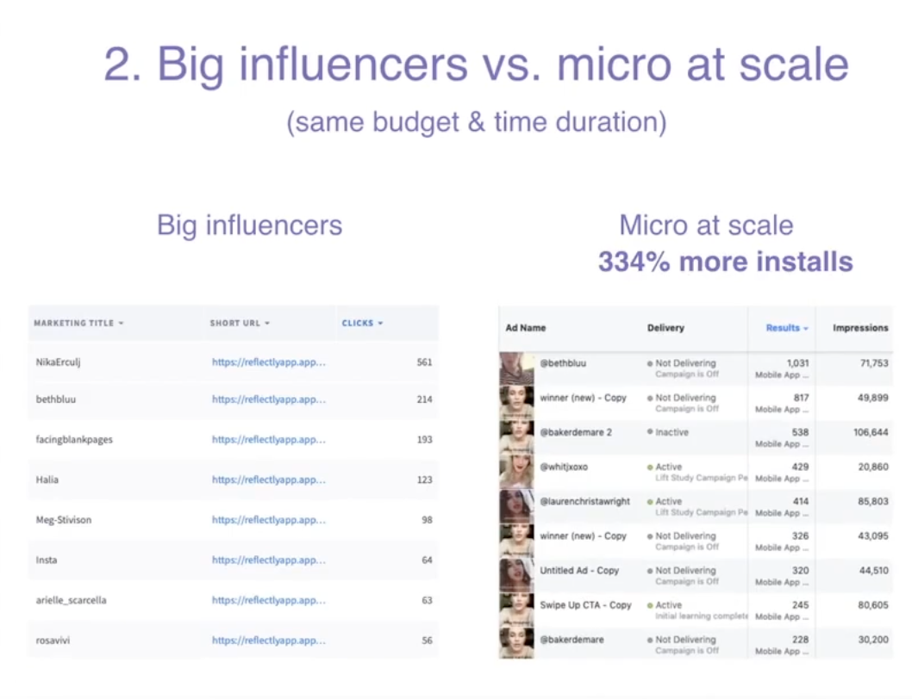
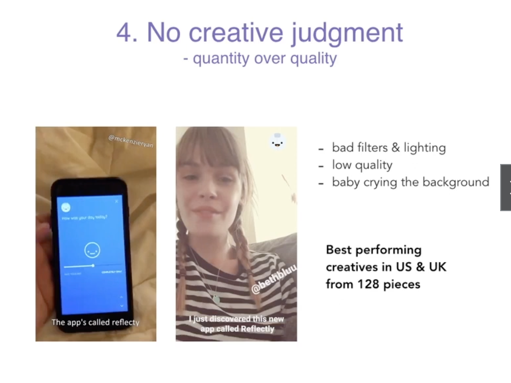
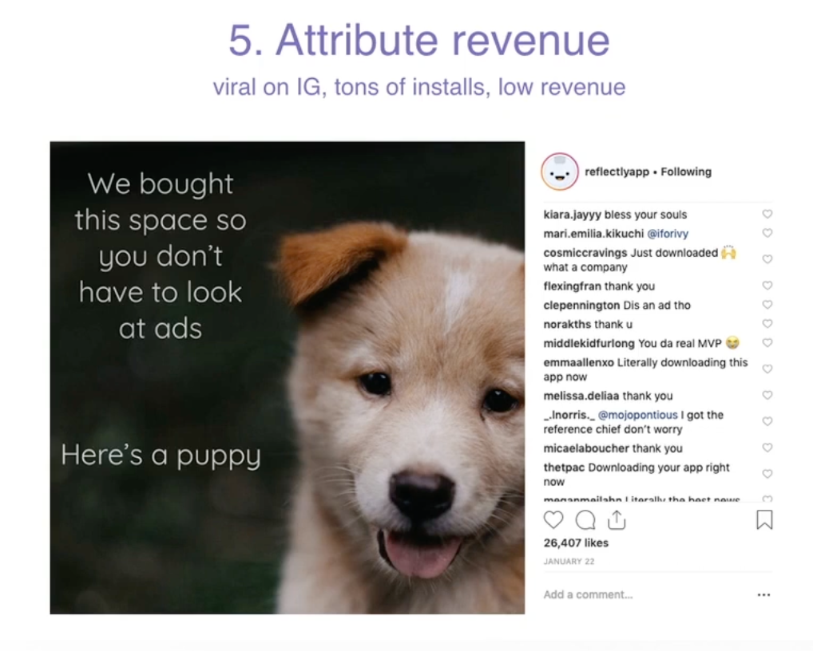
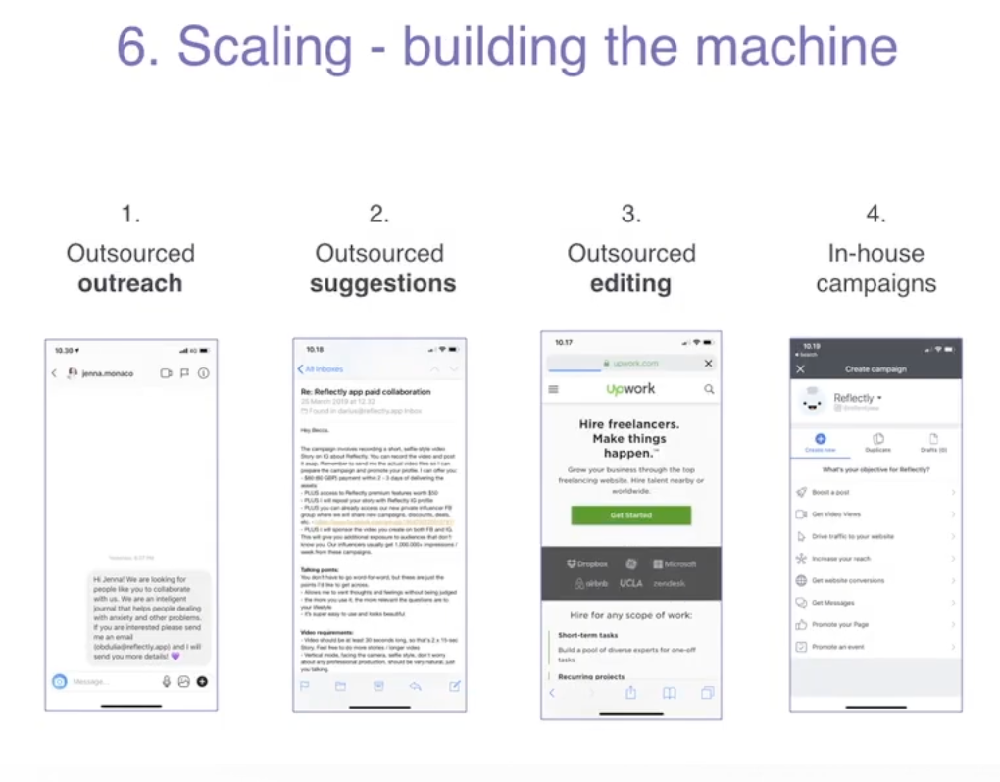

https://chat.openai.com/c/4064ce05-9cbb-49d9-b4fa-e1c856263b60

# Instructor

https://www.dariusmora.com/

- Tiktok is the most powerful marketing tool for app marketing.

---

# Key Information

## Tips

- Don't put some keywords like `app`. It's useless
- Only once you've really saturated and fulfilled this one market, then start looking into other markets, at least 6 figures monthly revenue. (Localization)
- If your 30% revenue comes from another country, then you can consider A/B Test for different price for each country. (Price Localization)
- Read Competitor's App Reviews to get insight
- InAppEvents works great if you want to attract more traffics. But it doesn't affect your ASO Score.
- WatchOS Tips: They'll be using shorter phrases to look for your app
- WatchOS Tips: The good news is there is less competition overall
- App Clip Tips: App Clip is a tiny version of your app or game that can be shared outside of the App Store
- App Clip Tips: It doesn't affect your ASO
- App Clip Tips: It might be a good idea to use app clips if you have an audience that can have a chance to try out your app without installing the full thing
- iPAD: Optimize screenshots for bigger screens
- UI & UX: In the US Fitness Category, conversion rate to subscription is 3%. 100 installs => 3 subscriptions
- UI & UX: Static Onboarding, 4 screens are the best
- UI & UX: Onboarding especially for fitness apps, you can add upto 15 screens, but it must be really interactive
- UI & UX: Guide users in the interactive ways
- UI & UX: Don't make people read manuals
- UI & UX: Introduce Information Gradually
- Retention is higher on the social network

## Summary

- Order of keywords matter
- Don't satisfy with one app icon, always execute A/B Test
- High Quality Screenshots
- Writing a description strategy: testimonials, feature lists, and clear subscription information enhances the descriptio

### ASO Ranking Factors

1. Download Velocity
   - This is overall how many installs your app is getting
   - Very dynamic
   - If you got many downloads yesterday, your rank for the keyword will be high, but if you get a fewer downloads today, your rank for the keyword will be dropped. ⇒ Very dynamic
   - Updated twice a day
2. Keyword Specific Conversion Rate
   - This happens even if app doesn’t have keywords on the metadata.
   - You don’t have to include a keyword in your metadata to rank for it but very high conversion rate.
   - In order to get high conversion rate for a specific keyword, you need to understand what is the most important one, two, three, four or five keywords for your business.
   - **Hyper Focus on a few important keywords when getting started**
3. Ratings & Reviews
4. Update Cycle ⇒ Update ASO
   - Update ASO **once a month**
5. Product Retention
6. Revenue

### ASO Algorithm Essentials

- **Download Velocity**: Represents the immediacy of your app downloads.
- **Keyword-Specific Conversion Rate**: Denotes the conversion success of each keyword.
- **Ratings and Reviews**: User feedback that substantiates the quality and usability of your app.
- **Update Cycle**: Frequent updates signal an active and well-maintained app.
- **Retention Rates**: Demonstrates sustained user interest and engagement with your app.
- **Revenue**: A measure of profitability that signifies the app’s market success.

### [Five Steps for Ranking #1 in your target keywords]

1. Fantastic product: Build a fantastic app that people love
   - Don’t invest time until you build a product that people love
2. Perfect Keywords: Pick top keywords for your app
3. Update your app and ASO monthly
4. Ask for reviews
5. Great VisualsL Top Notch Icons, Screenshots, Videos ⇒ A&B Test

### Strategies for Selecting Keywords: A Comprehensive Guide

In this lesson, a streamlined strategy for selecting powerful keywords to optimize App Store visibility was unveiled. Here’s a summative guide to the insights shared:

**1. Selection Process:**

- A methodical three-step process is essential:
  - Analyzing relevant keywords
  - Selecting the top 20 keywords
  - Creating an appropriate sequence of keywords in metadata

**2. Utilizing Third-Party Tools:**

- Tools like AppTweak can enhance your keyword analysis process, enabling the extraction of strategic insights for keyword optimization.

**3. Focused Keyword Analysis:**

- Aim for keywords with high traffic and low competition.
- Opt for long-tail keywords for a nuanced and targeted approach, especially if your app is new or has a smaller user base.

**4. Understanding Keyword Characteristics:**

- Analyze each keyword’s volume and competition to assess its potential effectiveness.
- Consider relevance, ensuring each keyword genuinely aligns with your app’s functionality and user benefits.

**5. Exploring a Range of Keywords:**

- From generic to specific, broad to niche, explore a variety of keywords. Even those with lower traffic might prove valuable due to lower competition.

**6. Localization and Customization:**

- Tailor your keywords based on regional language preferences and usage trends.
- Avoid using generic terms like "app" in your keywords unless they are part of a well-known phrase or search term.

**7. Continuous Optimization and Testing:**

- Regularly update and optimize your keywords, adapting to changing trends and competitive landscapes.

### How to find the perfect keyword for your app or game

- Relevant, Volume around 10 ~ 40
- **Start from Low Difficulty Keywords when you don't put enough budget for your app**
- Makeing a title and a subtitle is not just about the algorithm, your title should make sense for people who read it
- Place low competition keywords at the beginning of your keyword fields
- For Description, copy all the keywords and give it to AI

### iOS Screenshot Test

- Use only 1 treatment to extract the correct data
- Traffic Proportion, 50%
- One Localization at a time
- Estimate your test duration
  - Select options as you wish
    - 100% improvement
- Run the test at least for 7 days
- Run only one test at any given time, keep the data clear

### How to get featured and become the App or Game Of The Day

- Tens of thousands of installs in a single day

**Increase your chancess of getting featured**

https://developer.apple.com/contact/app-store/promote/

- High Quality App, No Crashing, Working almost perfectly
- App built natively (Rumor)
- Newly added OS features (For Example, Widget)
- App must be regularly updated (Someone is working actively, like updating once a week)
- Showcase high retention and high revenue
- Beautiful experience, Great Design
- Actual Conversion might be low
- Small target like Germany, South Korea might be easier
- Go on LinkedIn, find people with job titles "App Store Editor"

### Master Contents Marketing

1. Master the platform
2. Master the content
   - Entertain or Educate
   - Find a trending music and incorporate it into your video
     - Low Volume
   - Think about your audience
     - Put your self in the shoes of the person that can be consuming your content
     - Understand
       - What are their patterns
       - What are they seeking
       - What are they looking for
   - Post ten times a day
     - The more frequently you post, the more results you are going to see
   - Consistency
     - #1 Factor is consistency
     - Constantly Posting is the key
   - Best Time
     - If you find time that works for you, stick to it

### Long-format, horizontal video (Youtube)

- Consistency is the key
- Youtube Customers convert better
- Ideal Video Length 8 mins (8 mins to 30 mins)
- Ideal to create your contents in bulk
- You need to inform people or make them feel some kind of an emotion on Tiktok and Instagram reels and youtube shorts
- Youtube long format, you need to show your face. That's the most effective way.
- Make Videos for your audience
- Build it for your audience
- Don't overthink it
- "Start with what you have right now"

### Text-based (LinkedIn, Medium, Twitter, Blogs)

- LinkedIn is a fantastic platform for B2B or professional audiences.
  - Create Articles
  - Writing a proper blog post
  - Consistency is the key
- Twitter
  - Consistency
- Tips for production
  - You could get someone to write articles, turn my videos and podcasts into articles.

### Audio-based (Podcasts)

- Consistency is the key
- Podcasts are very long formats
- Incredible Benefits
  - Super Long Format
  - If somebody listens to you for an hour, they start to trust you
  - for 1 hour ~ 4 hours
- Quality matters
- Contents Format
  - Interview
  - Talk about different topics
    - Bigger Topics
    - My first million dollars story for example
- But this platforms require a lot of energy
- Microphone is important ($50)

### Group Based (Reddit, Facebook)

- Become a member of community and contribute by being helpful, by answering, by doing a lot of work for free, then you are going to get some leads.
- It doesn't really work at scale
- If you're starting from zero and if an app or game has no attention right now
  - Creating conversation and engagement and feedback is great
- Facebook groups are a great way again to engage and answer questions
- Subreddits are a great way to find lots of fantastic engaging niches. But you have to be very careful not to be spammy, not to seem like you're advertising.
- Quora is great
- WhatsApp is a great channel

### PR-based

- Not that many audience
- Mostly tourist users
  - Conversion rate is low
- Not long-term marketing growth strategy

**_Three Main Ways_**

- https://www.helpareporter.com/
- Hire agency => Press something you pay for
- Hard grind yourself. Message 1,000 reporters

### How to get low-cost, top-performing content for your ads

https://www.youtube.com/watch?v=NrtU_R27vUI

- 20,000 ~ 30,000 installs everyday

**Reflectly**

- Journal App
- $35 to $50 subscription price

### 6 User acquisition insights

1. Influencer ads vs. produced ads

   - Influencer ads outperformed
     - Micro Influencers $20 to run an ad
     - But not always!
   - West vs East
     - West, Influencer ads worked better
     - East (Asia), produced ads worked better
   - Own voice
   - Price

2. Big influencers vs micro at scale

   - Big Influencers
     - $1,000 with 100,000 followers
   - Micro Influencers
     - $20
   - Mirco Influencers won.
     - 334% more installs



3. Context

   - US
   - UK
   - AU
   - NL

4. No creative judgment

   - Quantity over Quality
   - Bad filters & lighting
   - Low Quality
   - Baby crying the background



5. Attribute Revenue

   - viral on IG
   - Tons of installs
   - Low Revenue



6. Scaling - building the machine

   1. Outsourced outreach
   2. Outsourced suggestions
   3. Outsourced editing => Video Editing
   4. In-House campaigns



### How to solve the Attribution problem

- Mobile attribution is the process of attributing certain users to certain marketing campaigns.
- This only makes sense if you are running campaigns on several different marketing channels.
- If you are only running ads on one channel, you don't need attribution.

**Platforms**

- Branch, Mobile Measurement Partner (MMP)
  - https://www.branch.io/
- Adjust
  - https://try.adjust.com/
- Appsflyer
  - https://www.appsflyer.com/ko/

### My Four-Step-Testing-System

- When you start advertising, there is a thousand different decisions you could be making. There's lots of different channels, lots of different pictures or videos, different types of content. You could be trying lots of different options of who you target, what kind of countries, what kind of age groups. It's just on and on. The problem is, if you don't have a clear list of priorities, if you don't know what is important and what is not important, you're going to waste a lot of time and money.
- Most platforms require $10,000 spending for optimization

1. Channel
   - User behavior is different
   - Go to where your users are
2. Audience, Targeting Number
3. The creative
   - Test different types of contents
4. Conversion Optimization
   - 1% improvement

### How to harness the advertising power of Google (Android & iOS)

https://www.udemy.com/course/app_marketing/learn/lecture/36501356#overview

- App Install
- Select Location Manually
  - All cooutnries BIG NO NO
  - Target Specific Countries
- One Week Campaign For Test
- Target cost per install
  - maximum expense
  - $1 per a download
- The more images and videos and text you add, the longer it is going to take to find the optimal solution

### Easiest advertising tool: Search Ads(iOS)

https://www.udemy.com/course/app_marketing/learn/lecture/36501364#overview

**Advanced Version**

- Target Specific Keywords
- Different Asset

**Basic Search Ads**

1. Deselect All Countries
2. Target only your targeted countries
3. Set Monthly Budget

=> Recommended if you are just getting started

**Advanced Seacrch Ads**

1.  Product Placements

- Today Tab
- Search Tab => Recommended
- Search Results => Highly Recommended
- Product Pages

=> Try testing for all four placements

2. Target only your targeted countries

3. Set Daily Budget

- $20

4. Schedule

- Always Set End Date

5. Max CPT Bid => Ad Group Settings

- How much you are willing to pay for `tap` => but it doesn't mean they will install your app
- $0.20

6. Set Ad Group Settings End Date

- It's different from your campaign.
- Ad group can be independantly terminated

7. Audience

- All Eligible Users or Choose Spcific Audiences
  - Devices
  - All Users, New Users, Users of my other apps, Returning Users
    - New Users
  - Demographics
    - Gender
    - Age

### How billion-dollar companies are created through Facebook & Instagram ads

https://www.udemy.com/course/app_marketing/learn/lecture/36501368#overview

- You must create a separate ad account even if you have facebook or instagram account.
- Facebook ads can be really cheap if your product is really good

**Kind of Ads**

- Awareness
- Traffic => Highly Recommedend for Mobile App
  - Good for Website
  - Much Cheaper
- Engagement
- Leads
- App Promotion => Recommedend for Mobile App
- Sales

=> You can try testing for traffic & app promotion

**App Promotion Campagin Types**

- Advantage+ App Campaigns => Recommendend
- App Ads

**Layers**

- Campagin
- Ad Groups
- Ad

**Campaign Level**

- Choose these options
  - Buying type => Auction
  - Advantage+ App Campaigns

**Ad Set Level**

- App Store
- Select Country
- Optimization Goal => App Installs
- Set a bid cap => $1
- Daily Budget => $10
- Schedule => One Week

**Ad Level**

- Link your facebook page and instagram account
- Creative Source
  - Manual Upload
- Format
  - Singme Image or Video
  - Format is very important for your ad price
- Recommended CTA
  - Learn More
  - (Install Now is expensive)

### Become an industry leader on TikTok

- Three Layers
  - Campaign
    - Ad Sets
      - Ads
- Conversions are not so good
- Work directly with influencers
  - Influencers create your posts
  - You can boost it

### Bonus Interview: Paid Marketing vs Organic Growth

- Reflectly got 40,000 emails on the landing page in the first couple of weeks
- Not monetized for 6 months
- Micro-influencers at Scale
  - Pay tiktokers to create videos
  - Zero Creative Judgement
  - Poor Quality, looking like a content wins
  - Run everything
  - Contents they deliver is the king, super valuable
- If you have time, post contents yourself, if you have money, run ads
- The product should be good. People waste their time and money on the product that's not working
- You have 1,000 questions to answer and problems to solve. Focus on building something great
- Reflectly is a ridiculolusly simple product. First two years, there was only one feature.
  - You just go in and you write how you feel and you add some emojis.
  - App doesn't have to be complicated
- If you want to build an app in a category, try to talk to as many people as possible who are a few steps ahead of you
  - Find any app, find their support, reach out 50 of them. Try to contact.

**Pre-orders**

- Pre-orders, 6 months (180 days)
- A huge advantage

**Important Factors**

1. Make sure that what we're building resonates with the community
   - Make sure that we know that whatever we are building should have a potential to make money
   - If there are other apps that generate revenue but they are not very good, make a better product
2. Pre-order
   - Get traffics from the beginning

**Create Community**

- Create Community for B to C
- Build a community that wants a specific thing.
- Email List
- Tiktok
- Instagram
- Facebook Community Page

**Important Things**

- Pattern
- Choosing the right place
  - Right category
  - Right product
  - How to reach people
- Features don't actually matter
- Do one thing great

**Landing Page Strategy**

- Validate your idea through Landing Pages
- Created Three Different Ideas with Landing Pages (Only Landing Pages)
- Reflectly stood out

**Baseline Metrics**

- Are you making money more than you spend it?
- If your ads are not making any money, look at the funnels
  - Platform Problems?
  - Asset Problems?

**Budget**

- No money at all => build products
- $1,000
  - Start Apple Search Ad
  - Check if your app make $1,000
- Start with $10 at the beginning for each campaign
- How much are you willing to risk for your idea?

### Acquire Companies

- As you start to scale and go up, you'll hit a celing of how much money you can spend profitably
- Acquire other apps that have really good traction on the app store
  - Different Ways to acquire users
- Factors to consider
  - Organic Ranking of the app
  - Motivation app, which makes $600,000 a month => Super Product
  - Look for apps that have really high significant ranking for keywords that matter
  - Reach out people, a lot of outreach

### Micro Influencers

- 5 to 20,000 followers on Instagram
- Distribution is not that worth it
  - What we pay for is the creative content
  - Run it on Facebook ads or Instagram ads

---

# Differences between SEO and ASO

1. **User Behavior:**

   - SEO: People often type full sentences in search engines like Google, e.g., "amazing apple pie recipes for beginners on a budget".
   - ASO: In app stores, users typically use short phrases or keywords like "apple pie" or "apple pie recipe".

2. **Commitment Level:**

   - SEO: Clicking on websites requires minimal commitment. Users can easily open multiple tabs without any significant consequence.
   - ASO: Installing an app involves a perceived higher commitment due to factors like phone storage, download time, and data usage. The psychological perception of commitment is also more profound.

3. **Presentation:**
   - SEO: Primarily text-based, with search results displaying links and descriptions.
   - ASO: Offers a mix of text and visuals, including screenshots, videos, and other graphic elements.

These differences emphasize the unique considerations needed for optimizing website content (SEO) versus app store content (ASO). The subsequent video will dive into the foundational elements of ASO.

---

# Fundamental Pillars of ASO (ASL)

In this video, the key elements of App Store Optimization (often mistakenly referred to as ASL in the text) were discussed. The four central pillars of ASO are:

1. **Logo (App Icon):**

   - Often the first thing users notice.
   - Can significantly influence a user's decision to install or skip an app based on its appearance alone.

2. **Screenshots:**

   - Holds immense visual importance in the app store.
   - Considered a major influencer in conversion rates, determining whether users will install the app or not.

3. **Videos:**

   - Their effectiveness varies: works better for games than for apps.
   - Not all apps benefit from having a video presentation, but this will be discussed in detail in future lessons.

4. **Metadata (Keywords):**
   - Crucial from an algorithmic standpoint, determining how an app ranks in search results.
   - It doesn't directly influence user psychology but is essential for app visibility.

Each of these elements will be explored in-depth in upcoming lessons. The subsequent video will focus on the app icon, its significance, and best practices.

---

# App Logo

In this video tutorial, we learned about the importance of an app's icon and the distinct approaches for designing icons for apps and games. Let's summarize the key takeaways:

1. **Difference between Apps and Games Icons:**

   - Apps: Generally use the brand or company logo or the name of the app itself.
   - Games: Often utilize game visuals or a popular character's face/body. They typically avoid using text or titles in the icon.

2. **User-Centered Design:**

   - Understand your target audience and design your app's icon accordingly. Consider factors like color, shapes, and other visual elements that will resonate with them.

3. **Check the Competition:**

   - While it's not recommended to copy, you can certainly derive inspiration from competitors that are performing well. Analyze their design choices and think about how you can differentiate your icon while still appealing to your audience.

4. **Experimentation:**

   - Don't settle for just one version of your icon. A/B testing, experimenting with colors, and tweaking designs can result in better conversion rates.

5. **Consistency across Platforms:**

   - While it's not crucial to have identical icons on iOS and Android, maintaining some semblance of brand consistency is essential.

6. **Design Tools & Platforms:**
   - **Canva**: An easy-to-use design platform for creating app icons with various templates.
   - **Fiverr**: A platform to find freelancers who can design custom logos for your app.
   - **EasyAppIcon**: A website that generates various sizes of your app icon suitable for different devices and platforms.

Remember, the app icon is often the first visual touchpoint users have with your app. Hence, ensuring it's well-designed, user-centric, and aligned with your brand can significantly influence a user's decision to download your app. Always keep the user in mind, and continually iterate based on feedback and results.

---

# Successful Screenshots: A Visual Walkthrough

_Interesting Facts:_

- People only spend 7 seconds on your appstore before they either move on to another app or install the app => You only have 7 seconds to capture audience.
- Only 9% of people will actually scroll through all of the screenshots => Focus on the first three screenshots

Alright, let's dive into some examples of successful screenshots from both the App Store (iOS) and the Play Store (Android). By analyzing these examples, you'll get a better grasp of the principles we discussed earlier.

_Remember, the key principles are:_

1. **Communicate the Benefit**: Instead of just talking about what your app does (features), you should convey the value or the advantage a user will gain by using the app. => What the person will get out of the experience, not what the actual app does.

   - Feature: You have 5,000 recipes that can be filtered by price and complexity.
   - Benefit: You have recipes that help people lose weight and don't require much time.

2. **Uphold Brand Identity**: The aesthetics and design of your screenshot should communicate the identity of your brand, making it both attractive and trustworthy to potential users.

   - The standard for communication is high on the visual side, so you need to make sure that your screenshots are absolutely stunning.

**iOS App Store Examples:**

1. **Fitness App**

   - _Screenshot 1_: A well-toned individual using the app with a headline "Achieve your fitness goals faster!"
   - _Screenshot 2_: A snapshot of a customized workout plan with text "Tailored workouts just for you!"
   - _Screenshot 3_: A motivational community feed with "Join a community that motivates you!"

   _Analysis_: Here, instead of just saying "5000+ workouts", the app communicates the benefit of tailored workouts and the value of a motivating community.

2. **Recipe App**

   - _Screenshot 1_: A delicious meal with the caption "Cook mouth-watering dishes effortlessly!"
   - _Screenshot 2_: Filters being adjusted with the text "Find recipes based on ingredients you have!"
   - _Screenshot 3_: A quick tutorial video playing with "Learn with step-by-step videos!"

   _Analysis_: Rather than just stating the number of recipes, the screenshots highlight ease of cooking, customization, and learning through videos.

**Play Store (Android) Examples:**

1. **Productivity App**

   - _Screenshot 1_: A clean task list interface with the text "Stay on top of your tasks effortlessly!"
   - _Screenshot 2_: Calendar integration highlighted with "Never miss a deadline again!"
   - _Screenshot 3_: App widget on a phone home screen, "Access tasks right from your home screen!"

   _Analysis_: The emphasis here is on ease of use, integration, and accessibility. No mention of "100+ features" but instead the benefit of not missing out on tasks and deadlines.

2. **Adventure Game**

   - _Screenshot 1_: A thrilling scene from the game with the title "Embark on a legendary adventure!"
   - _Screenshot 2_: A character choosing weapons, "Customize your hero's weapons & skills!"
   - _Screenshot 3_: Multiplayer mode being showcased with "Team up with friends and conquer!"

   _Analysis_: The game doesn't just highlight its graphics but the excitement of adventure, customization, and social play.

To conclude, when designing screenshots for your app or game, it's essential to put yourself in the shoes of a potential user. What would entice them? What value do they gain from your app or game? Those are the stories you want your screenshots to tell.

Lastly, regarding getting those stunning screenshots: today, there are multiple tools and platforms online that help in designing professional app screenshots. Tools like `AppInstitute's Screenshot Maker`, `Placeit`, and `AppLaunchpad` can be invaluable. Always ensure you adhere to the size and design requirements of each platform for the best results.

Grab a coffee, dive deep into crafting those screenshots, and remember, it's the first impression that often counts the most in the app world. Good luck!

---

# Breaking Down the Play Store Screenshots

To summarize the exploration of the Google Play Store, let's break down the observations made on app and game screenshots:

**1. App Screenshots:**

**Duolingo**:

- _Strategy_: Lead with brand recognition, then dive into features.
- Screenshots displayed:
  1. Social proof from a reputed source (Wall Street Journal).
  2. Highlighting the array of languages offered.
  3. Emphasizing its free access.
  4. Showcasing lessons, practicality, and goal-oriented approach.
- _Key Takeaway_: Duolingo uses its brand's power to its advantage and then effectively communicates its primary offerings.

**Blinkist**:

- _Strategy_: Directly appeal to the target audience's needs and pain points.
- Screenshots displayed:
  1. Showing a vast range of bestsellers.
  2. Highlighting the essence of their offering - summaries.
  3. Associating with top brands.
  4. Emphasizing personal growth.
  5. Highlighting social features.
- _Key Takeaway_: Blinkist effectively positions itself as a solution for busy, ambitious individuals. The screenshots are tailored to resonate with this particular audience.

**2. Game Screenshots:**

**Match**:

- _Strategy_: Gameplay and in-game characters are at the forefront.
- Screenshots displayed:
  1. Showing game characters.
  2. Highlighting gameplay elements.
  3. Introducing different in-game features.
- _Key Takeaway_: The graphics and gameplay are paramount in selling the game. Match capitalizes on this by putting them front and center.

**Subway Surfers**:

- _Strategy_: Prioritize gameplay and characters without textual distractions.
- Screenshots displayed:
  1. Logo with game characters for brand recognition.
  2. Actual gameplay in various settings.
- _Key Takeaway_: Subway Surfers, being a popular game, leverages its brand power. The gameplay is visually appealing enough to stand on its own without the need for textual overlays.

**General Observations**:

- For **apps**, there's a more diversified approach to screenshots. This includes features, benefits, social proof, and even lifestyle elements. The focus remains on communicating the app's value proposition.
- For **games**, the screenshots predominantly feature gameplay and in-game characters. This is because the visual appeal and gameplay mechanics are usually the primary selling points for games.

**Final Thoughts**:
Designing impactful screenshots requires a combination of understanding your target audience, showcasing your app or game's USP (Unique Selling Proposition), and ensuring that the design is top-notch.

Always remember, a good screenshot doesn't just show what's inside the app or game; it tells a compelling story about the experience awaiting the user.

---

# Creating App and Game Screenshots: A Summary

Getting captivating screenshots for your App Store or Play Store listing is crucial. They play a pivotal role in influencing a potential user's decision to download your app or game. Here's a concise summary of what you've just explored:

**1. Importance of Screenshots:**

- **Average User Behavior**: Users spend only around 7 seconds looking at screenshots before making a decision.
- **Engagement**: Only 9% scroll through all screenshots, making the first few incredibly vital.

**2. Differences Between Platforms and Types:**

- **iOS vs. Android**: They might have different styles, dimensions, and best practices.
- **Apps vs. Games**: Apps typically use portrait-style screenshots, while games might use landscape-style.

**3. Communication Strategy for Screenshots:**

- **Benefit-Oriented**: Showcase what users gain from your app, not just its features.
- **Engaging Content**: Utilize lifestyle images, statistics, press mentions, or anything that boosts credibility and engagement.

**4. Creating Screenshots:**

**a. DIY Tools like Screenshots Pro:**

https://screenshots.pro/

- _Pros_: Cost-effective and fast.
- _Cons_: Limited customization; might not provide unique designs.

**b. Fiverr:**

- _Pros_: Wide range of designers, often cost-effective. Suitable for one-off tasks.
- _Cons_: Quality can vary; important to check reviews and past work.

**c. Upwork:**

- _Pros_: Platform designed for longer collaborations; allows for continual testing and optimization.
- _Cons_: Might be more expensive than Fiverr for one-off tasks.

**5. Working with Designers:**

- **Clear Communication**: Provide examples of the style you're aiming for to guide designers.
- **Regular Testing**: If your budget allows, work with a designer on an ongoing basis. Regularly testing and updating your screenshots can optimize conversion rates.

**In Conclusion**:

Screenshots are your storefront on app marketplaces. They play a crucial role in converting views into downloads. Remember that the ultimate goal is to showcase the unique value proposition of your app or game in a way that resonates with your target audience. Once you've optimized your screenshots, integrating videos can be the next step to further enhancing your listing.

---

# App and Game Video Promotions: A Summary

Promoting apps and games using videos can dramatically impact user engagement and conversion on App Stores and Play Stores. Dive into the nuances of using videos effectively:

**1. Role of Videos in Promotion:**

- **User Perspective**: Viewers want to get a taste of gameplay or app functionality before downloading.
- **Engagement Levels**: Videos often work exceptionally well for games, less consistently for apps.

**2. Platform and Type Variations:**

- **iOS vs. Android**: Features like autoplay on WiFi on the App Store affect user engagement with videos.
- **Apps vs. Games**: Games usually emphasize videos more due to their visual and interactive nature.

**3. Strategy for Video Content:**

- **Showcase Real Experience**: For games, highlight actual gameplay; for apps, display core benefits or features.
- **Quality vs. Quantity**: While games might require high-quality videos, apps can sometimes get by with simpler visuals.

**4. Producing Videos:**

**a. In-House Production:**

- _Pros_: Control over content and style.
- _Cons_: Can be resource-intensive and time-consuming.

**b. Outsourcing:**

- _Pros_: Access to professional quality and expertise.
- _Cons_: Cost can be a factor; essential to provide clear guidelines to external teams.

**5. Key Points to Remember:**

- **Testing is Crucial**: Always test the effectiveness of a video. What works for one app or game might not for another.
- **User Behavior Insights**: Understand that not all users will watch videos in full screen or with sound, so visuals should be compelling even without audio.

**In Conclusion**:

While screenshots are the visual storefront for apps and games, videos bring the experience to life. They can offer potential users a deeper dive into what to expect, increasing the chances of downloads. However, always monitor video performance and be ready to iterate based on feedback and results.

---

# Understanding ASO Metadata: A Summary

In the realm of App Store Optimization (ASO), both human and algorithmic forces play pivotal roles in determining an app's visibility and success. Let's delve deeper into the importance of metadata and its impact:

**1. The Two Fundamental ASO Forces:**

- **Human Force**: Targets the actual users of the App Store. Tools to entice this audience include images, videos, icons, and readable text.
- **Algorithmic Force**: Governed by the App Store's algorithm, it decides an app's rank based on keywords.

**2. Importance of Different Elements:**

- **Screenshots**: Central to the human force, they directly influence user's decision to download.
- **Metadata and Keywords**: They play a cardinal role in the algorithmic driving force.

**3. Metadata Insights:**

- **iOS**:
  - Key components include the app name (e.g., Vitality Mental Health Trainer) and subtitle (e.g., Emotional Health and Mind Coach).
  - The submission version further offers a description and a keywords field.
  - "What's New" and promo texts aren't indexed by the algorithm.
- **Play Store**:
  - The main store listing comprises the app name, short description, and full description.

**4. Importance of Metadata Selection:**

- **Visibility Impact**: The choice of metadata can either skyrocket your app to prominence or make it obscure.
- **Striking the Balance**: The optimal metadata is both human-readable and algorithm-optimized.

**5. Key Takeaway**:

The goal of ASO is to ensure when a specific keyword (like "meditation") is searched, your relevant app tops the list. Achieving this requires a nuanced understanding of metadata and effective keyword usage.

**In Conclusion**:

With the right blend of keywords and metadata, you can bridge the divide between human and algorithmic forces in ASO. The next section will delve deeper into the intricacies of metadata, guiding you to optimize your app's visibility. Ready to dive in? Let's explore.

---

# Completing AZO Fundamentals: A Recap

Congratulations on completing the AZO Fundamentals! You've embarked on a journey to understand the nuances of App Store Optimization and have successfully grasped its core principles. Here's a quick summary of what you've learned:

**1. SEO vs. ASO:**

- Recognizing the distinct difference between Search Engine Optimization and App Store Optimization.

**2. Four Pillars of ASO:**

- **Metadata**: The backbone of algorithmic visibility.
- **Icon**: The initial touchpoint for users. Regular testing ensures the highest conversion rate.
- **Screenshots**: The paramount human-centric element in ASO. Despite being viewed briefly (on average 7 seconds), they wield significant influence on a user's decision.
- **Videos**: Predominantly utilized for games to provide a dynamic preview.

**3. Key Insights:**

- The icon stands as the first visual representation of your app to potential users.
- Screenshots play a pivotal role in capturing a user's attention in a short span.
- Videos, while more popular for games, offer a vivid introduction to an app's capabilities.

**4. Looking Ahead**:

As you transition to the subsequent section, prepare to delve deeper into metadata's intricacies. This in-depth exploration will empower you to master every aspect of ASO and optimize your app's presence in the marketplace.

Stay curious, and let's dive into the world

of metadata together!

---

### How to create the ultimate Title

**iOS App Title: Understanding its Significance**

In this lesson, we focused solely on iOS, emphasizing the vital role the app title plays in ASO. Let's recap the key points:

**1. Two Driving Forces in ASO:**

- **Human Force**: Screenshots stand out as the most crucial element. They give potential users a visual sense of the app's functionality.
- **Algorithmic Force**: Metadata is at the forefront, directing how the app is indexed and how it ranks in search results.

**2. Principle of Priority in Metadata:**

- The App Title (or App Name) holds the topmost priority in the algorithm.
- This is followed by the Subtitle, Keyword field, and finally the Description.

**3. Delving Deeper into the App Title:**

- It can be up to 30 characters long, including letters, spaces, and special characters.
- Words placed at the beginning of the title hold more weight with the algorithm than those at the end.
- While keyword optimization is vital, it's equally crucial to maintain human readability.

**4. What to Include and What Not to:**

- Typically, it's advisable to lead with the brand name, followed by one or two significant keywords.
- Avoid using competitor brand names in your metadata.
- There's no need to use words like "app," "iOS," or "iPhone" in the title as all apps naturally rank for these terms.

**5. Looking Ahead**:

- In the upcoming lessons, we'll delve into keyword research, helping you identify and optimize the right keywords for your app title and ensure top rankings in your category.

It's essential to remember that while the app title plays a foundational role in ASO, a holistic approach encompassing all aspects of metadata will ensure optimal results.

---

# Craft a Subtitle that will get you more installs (iOS)

**iOS Subtitle: A Key Component in ASO**

In this lesson, we're diving into the significance of the iOS subtitle in the realm of App Store Optimization (ASO). Let's review the main points:

**1. Character Limitation**:

- Just like the title, the subtitle also has a limit of up to 30 characters, counting spaces and other characters.

**2. Principle of Priority**:

- When it comes to ASO, the subtitle holds the second most crucial position following the title.
- This principle implies that the algorithm gives more weight to the beginning characters of your subtitle than the ending ones.

**3. Strategic Keyword Placement**:

- As you conduct your keyword research, you'll likely compile a list of significant keywords.
- It's advisable to place the most vital keywords in the title and then use the subtitle to incorporate the next tier of important keywords.
- Always remember to place the more important keywords at the beginning of the subtitle for maximum impact.

**4. Visibility in Search**:

- An essential aspect of the subtitle is its visibility during search. When users search for an app on the App Store, both the title and subtitle appear in the search results.
- This visibility can influence potential users' decision to click on your app. A compelling subtitle can enhance conversion rates.

**5. Upcoming Lessons**:

- In the forthcoming lessons, we'll delve deeper into other metadata elements vital for ASO, like the keyword field.

In summary, while the app title remains paramount, the subtitle serves as a powerful tool in conveying your app's essence and attracting potential users. It's crucial to utilize this space wisely by balancing keyword optimization and user readability.

---

# How to optimize your Keyword Field(iOS)

**The iOS Keyword Field: A Behind-The-Scenes Powerhouse**

Welcome to this lesson where we'll be unpacking the keyword field, an integral but concealed component of App Store Optimization (ASO). Let's break down the key points:

**1. Character Capacity**:

- The keyword field offers space for up to 100 characters.

**2. Visibility**:

- Unlike the title and subtitle, the keyword field is clandestine. It's not accessible to App Store users. This feature lets you incorporate vital keywords without directly impacting the user's perception of your app.

**3. Proper Formatting**:

- One common pitfall many app developers encounter is inputting spaces between keywords. However, since this section is invisible to users, spaces serve no purpose and are redundant.
- The right way to input multiple keywords is to separate them using commas, without spaces. This approach ensures optimal use of the available character count.

**4. Principle of Priority**:

- In the hierarchy of ASO, the keyword field is third in line after the title and subtitle.
- As with the previous fields, the algorithm gives more significance to the initial keywords in comparison to the latter ones in the keyword field.

**5. Using Competitor Names**:

- Incorporating competitor names in the keyword field can be tempting and, while some developers may have done it without facing repercussions, it's a grey area. Officially, it's frowned upon by Apple's guidelines.
- While it might be a strategy employed by some, it's prudent to tread carefully. It's always recommended to abide by the rules and ensure you're not infringing on another entity's intellectual property or rights.

**6. Upcoming Topics**:

- In the next lesson, we'll explore the 'promo text' and the 'what's new' sections on the App Store, diving into how these features can further enhance your app's appeal and visibility.

In summation, while the keyword field remains concealed from the user's eye, it wields a considerable influence over your app's discoverability on the App Store. Thus, strategic keyword selection and optimal formatting are paramount to maximize this tool's potential.

---

# The ultimate App Store Description

**Recommdend Structure**

- Don't forget to put keywords
- Only 5% of people will start reading descriptions

1. Testimonials
2. Features
3. Transparent Subscription

**The Art of Crafting an App Store Description**

Welcome to our lesson on constructing an effective app store description! This section holds a significant place in App Store Optimization (ASO), despite being overlooked by many. Let's explore its intricacies:

**1. Size & Significance**:

- The description offers a generous space of up to 4,000 characters.
- Surprisingly, only a small percentage (about 5%) of users actually delve into the description. Most scan or skip it altogether.

**2. Optimizing for Algorithm vs. Users**:

- Given its vast size and the tendency of users to skip over it, the description is primarily an area to cater to the algorithm. This means strategically inserting relevant keywords to improve your app's visibility.

**3. The Power of Testimonials**:

- Starting your description with testimonials or positive feedback from satisfied users can immediately establish trust and credibility. Authentic praise can have a persuasive effect on potential users.

**4. Highlighting Features and Benefits**:

- A structured list, preferably with bullet points, detailing the app's benefits and features provides a clear and concise snapshot of what the app offers. This can be a quick reference for those few who do peruse the description.

**5. Transparent Subscription & Pricing Information**:

- Clearly detailing any subscription models, pricing, and features of premium versions can eliminate ambiguity and potential user dissatisfaction.

**6. Outsourcing or Automating the Writing**:

- If writing isn't your strength or if you're pressed for time, platforms like Fiverr offer freelancers who specialize in crafting app store descriptions.
- On the cutting edge, AI-driven tools can also be harnessed to generate descriptions, ensuring they are optimized for both the algorithm and the end-user.

**7. Upcoming Topics**:

- In our subsequent lesson, we'll shift focus to the 'promo text' and the 'what's new' sections. These elements further contribute to how your app is perceived and how well it ranks on the App Store.

In summary, the app store description is a canvas to paint a compelling picture of your app, both for the algorithm and the discerning user. Properly leveraging this space can significantly impact your app's success.

---

# Other iOS metadata pieces

**Promo Text & What's New: Making an Impact Beyond Algorithms**

Welcome back! In this lesson, we're wrapping up our discussion on app metadata by diving into two elements that directly cater to your users: the 'Promo Text' and the 'What's New' section.

**1. Understanding their Placement**:

- **Promo Text**: Positioned above your app description yet below the screenshots, the promo text offers a brief spotlight to capture user attention.
- **What's New**: Located above the screenshots, this section provides insights into the latest updates or features of your app.

**2. Algorithmic Significance**:

- Based on various studies and opinions, it appears that both 'Promo Text' and 'What's New' don't significantly impact algorithmic rankings.
- While some argue these sections are indexed, evidence leans towards them not being a primary factor in ASO (App Store Optimization).

**3. Leveraging Promo Text**:

- Limited to 170 characters, it serves as a flexible tool to showcase timely events or offers.
- Unlike the app name or subtitle, the promo text can be altered without needing to submit an app update.
- Example Use Case: For an e-commerce app, this space can highlight limited-time sales or offers.

**4. Maximizing 'What's New'**:

- Here, transparency is key. Inform users about recent changes, be it bug fixes, added features, or other improvements. This fosters trust and can encourage updates or fresh downloads.

**5. Their Primary Role**:
While they may not play a major role in the algorithm, 'Promo Text' and 'What's New' enhance user experience. They provide clarity, promote engagement, and can positively influence conversions.

**Up Next**: As we transition from Apple's App Store nuances, our upcoming lessons will delve into the world of Android, exploring essential metadata elements such as the app name, long description, and short description. Stay tuned!

---

# The perfect Android Title

**Crafting the Perfect Title for Your Android App**

Welcome back! Today, we're zoning in on one of the most critical components of your app's presence on the Google Play Store: the title. Let's unpack its significance, guidelines, and best practices.

**1. Understanding the Title's Constraints**:

- The title grants you a concise 30 characters, encompassing spaces and special characters.
- It's not just a name but a significant factor in the app's discoverability and initial appeal to potential users.

**2. The Principle of Priority**:

- While the app title, short description, and long description are all important, the title takes precedence in terms of SEO weight.
- Furthermore, within the title, prioritize placing the most impactful keywords closer to the start, as they wield greater influence on search algorithms.

**3. Striking a Balance**:

- Your app's brand name typically takes pole position, followed by relevant keywords.
- The challenge lies in ensuring the title is both user-friendly (easy to read and understand) and optimized for the algorithm.

**4. Staying Within Play Store Guidelines**:

- Steer clear of "performance-based" words. Terms like "best" or "#1" are frowned upon as they can seem misleading.
- Refrain from including calls-to-action such as "download now" or "get it today". Google prefers a more direct, informative approach.
- While generic terms are permissible, avoid using competitor brand names or trademarks. Remember, authenticity and originality are pivotal.

**5. To Summarize**:
The title isn't just a name – it's your app's first impression, its beacon for discovery, and a statement of its purpose. Craft it with care, keeping both users and the algorithm in mind.

**Up Next**: Now that we've grasped the nuances of an app title, our following lesson will explore the 'short description' and its role in enhancing your app's presence on the Play Store. Join us!

---

# Short Description to get more installs(Android)

**Diving into the Android Short Description**

Welcome to today's topic, where we delve into the nuances of the 'short description' on the Google Play Store and understand its significance in your app's discoverability and appeal.

**1. Importance & Length**:

- The 'short description' is a crucial metadata component on Android, ranking second in the hierarchy of importance, following the title.
- You have a generous 80-character limit, allowing for a more expansive range of keywords compared to iOS's 30-character constraints for title and subtitle.

**2. Crafting the Perfect Short Description**:

- Think of it as your app's elevator pitch. Within those 80 characters, you want to convey the core functionality and benefits of your app succinctly.
- Prioritize clarity over creativity. The goal is to provide potential users with a clear snapshot of what your app offers.

**3. Google's Guidelines**:

- Steer clear of "performance-based" words. Terms like "best" or "top-rated" can come off as promotional rather than informative.
- Avoid calls-to-action such as "try now" or "join today". Instead, focus on conveying the primary function or benefit of your app.
- The emphasis should always be on genuine and accurate representation of your app's core functionalities and benefits.

**4. The Role of Keywords**:

- While the short description offers a broader character limit, ensure you're judicious with keyword inclusion. The goal is not just to optimize for search but also to appeal to human readers.
- Use keywords that genuinely align with your app's functionality and can succinctly describe its main offerings.

**5. In Conclusion**:
The short description serves as a brief, yet impactful, introduction to what your app brings to the table. Use those 80 characters wisely to showcase your app's essence while adhering to Google's guidelines for authenticity and clarity.

**Up Next**: As we continue our journey into optimizing your app's presence on the Play Store, our next lesson will delve into the 'long description'. Stay tuned!

---

# The ideal Long Description (Android)

- Don't use the most important keywords in there!

**Stucture**

- Testimonials
- List of Features & Benefits
- Subscription Info
- Benefits of Premium Product

**The Power of Android's Long Description**

Welcome back! Today, we focus on one of the most extensive metadata elements for your app on the Play Store: the long description. While often overlooked, this section has tremendous potential, both for search optimization and for communicating with potential users.

**1. Quantity Meets Quality**:

- With a generous limit of 4000 characters, the long description provides ample space for keyword optimization. But remember, quality always trumps sheer quantity.

**2. Reading Habits**:

- Statistics indicate that only a small fraction, around 5%, of users will dive deep into the long description. Even then, their attention is primarily on the opening sections. Use this to your advantage by front-loading the most compelling information.

**3. Authenticity Over Repetition**:

- While it might be tempting to repeat keywords for algorithmic optimization, overdoing it can come off as inauthentic. Instead, aim for a natural flow that incorporates essential keywords organically.

**4. The Power of Testimonials**:

- Nothing speaks louder than the voices of satisfied users. Placing testimonials or user feedback at the beginning can lend credibility and trustworthiness to your app, encouraging more downloads.

**5. Highlight Features with Lists**:

- A structured list, complete with bullet points detailing the app's features and benefits, can provide clarity. Plus, on Android, you can leverage emojis and special characters to make the list engaging and visually appealing.

**6. Transparent Subscription Information**:

- If your app offers premium features, be transparent about the associated costs, benefits, and subscription details towards the end of the description.

**7. Outsourcing & AI**:

- Writing a captivating long description can be daunting. If you're pressed for time or unsure of your writing skills, platforms like Fiverr offer specialized services. Another intriguing avenue is leveraging AI for content creation, a topic we'll delve into in a subsequent lesson.

**In Conclusion**:
While the long description might seem secondary given its length and the limited readership, it's an underutilized tool that can significantly impact your app's discoverability and conversions. Utilize the space wisely, balancing between algorithmic optimization and genuine user appeal.

**Stay Tuned**: In our next segment, we will discuss the innovative ways AI can assist in crafting app descriptions that resonate and rank. Don't miss it!

---

# Get AI to do the work for you

**Leveraging AI for Crafting App Store Descriptions: A Modern Approach**

Welcome to a modern twist in the world of App Store Optimization (ASO) – the utilization of Artificial Intelligence (AI) to craft compelling app store descriptions. In this lesson, the integration of AI technologies, specifically models like GPT-3, into the ASO workflow is explored. Here’s a breakdown:

**1. Embracing the Ease of AI:**

- With the capability of AI like GPT-3, creating extensive, engaging, and effective app descriptions has been made simpler.
- It eliminates the daunting task of manually writing descriptions, especially given the vast character allowances (up to 4000 characters).

**2. Guiding the AI:**

- Your input is crucial. Providing the AI with sufficient, accurate, and clear information results in a more precise and useful output.
- Defining features, functionalities, and the unique selling points of your app will guide the AI in generating a description that is both authentic and reflective of your app’s capabilities.

**3. Art of Customization:**

- The AI’s output often requires human touch for refinement and customization. Ensuring that essential keywords are appropriately placed and that the content aligns with your app's true capabilities is key.
- Manually reviewing and editing the AI-generated content allows for a description that is both algorithm-friendly and user-engaging.

**4. Future of ASO with AI:**

- The realm of ASO is poised for transformation with advancements in AI. We might witness AI technologies that can fully optimize ASO processes, making manual interventions minimal.
- While we wait for such advancements, blending AI’s capabilities with human insights seems to be the most effective strategy.

**5. Concluding Thoughts:**
AI has surfaced as a powerful ally in ASO, simplifying tasks and adding efficiency to the process. However, it's essential to wield this tool with a layer of personal insight and strategy to ensure that the final output aligns seamlessly with your app's vision and offerings.

**Prompt**

```shell
Write a 1,000 characters of a mobile app that can be used as App Store Description on the App Store. This is a meditation app using soothing sounds to help people relax and fall asleep.
```

---

# Keywords vs Keyphrases

**Keywords and Key Phrases: Fine-Tuning Your ASO Strategy**

In this lesson, we delve into the nuanced world of keywords and key phrases, essential tools in the arsenal of App Store Optimization (ASO). Understanding their distinct roles and interplay is vital in fine-tuning your app’s visibility and searchability. Let’s break down the core concepts:

**1. Keywords: The Building Blocks**:

- Keywords act as the fundamental building blocks. They are the individual words that users might input in their search queries.
- Your app will be ranked based on each keyword independently, determining its visibility in the relevant search results.

**2. Key Phrases: Combining Forces**:

- Key phrases are combinations of keywords. They represent the strings of words users might type when searching for specific functionalities or app categories.
- Your app’s ranking will also be determined based on these combined key phrases, offering another layer of visibility.

**3. Practical Example**:

- Consider an app focusing on "storage cleaner." The app will be ranked for both "storage" and "cleaner" as individual keywords.
- Additionally, it will also secure a ranking for the combined key phrase "storage cleaner."

**4. Strategic Considerations**:

- Recognizing the dual role of keywords and key phrases allows for a more nuanced and strategic approach to ASO.
- This acknowledgment helps in planning and optimizing keywords to improve the app’s visibility across a broader spectrum of search queries.

**5. Looking Forward**:

- As we advance to more sophisticated ASO strategies, understanding the interaction between keywords and key phrases will be instrumental.
- Upcoming lessons will provide deeper insights, equipping you with the knowledge to become proficient in ASO practices.

In conclusion, mastering the application and interplay of keywords and key phrases is crucial in optimizing your app for enhanced visibility and user discovery in the app stores. Armed with this understanding, you're better positioned to navigate the multifaceted landscape of ASO.

---

# Wrap Up

**Congratulations: Moving Beyond the Basics of ASO**

Bravo! You’ve successfully navigated through the fundamentals of App Store Optimization (ASO), gaining valuable insights into metadata, keywords, icons, screenshots, and more. Let’s recap your journey and peek into what’s coming next:

**1. What You’ve Learned:**

- **Titles and Subtitles**: Crafting compelling, keyword-optimized titles and subtitles.
- **Keywords and Key Phrases**: Understanding their individual and combined impact on visibility.
- **Visual Elements**: Icons and screenshots, and their role in user engagement.
- **Utilizing AI**: Leveraging AI for writing and optimizing descriptions.
- **Platform Specifics**: Distinguishing between the specifics for iOS and Android platforms.

**2. The Journey Ahead**:

- The next segment promises a deeper dive into more advanced and strategic aspects of ASO.
- You'll explore keyword research, strategies to secure top rankings, and how to dominate your app's category.

**3. Expanding Your Mastery**:

- The upcoming lessons will equip you with practical strategies and tactics to elevate your app’s visibility, user acquisition, and overall success.
- You'll learn how to implement sophisticated ASO strategies to optimize your app's performance and growth.

**In Conclusion**:

Having grounded yourself in the basics of ASO, you’re now poised to delve into more strategic and advanced aspects that can substantially impact your app’s success. The forthcoming section promises a wealth of knowledge aimed at positioning your app at the pinnacle of app store rankings, turning your well-optimized app into a thriving business. Let’s dive into the exciting journey ahead! 🚀

---

# How to Analyze Keywords

**ASO Tools**

- AppTweak

**Important Factors**

- Traffic: How many people search for this keyword
- Competition: How many apps are trying to rank for this keyword
  => Find High Traffic, Low Competition Keywords

**Analyzing Keywords and Key Phrases: A Tactical Approach**

In this lesson, we delved deep into the mechanics of keywords and key phrases within the context of App Store Optimization (ASO). Unpacking the subtleties, here are the essential takeaways:

**1. Keywords and Key Phrases**:

- Understanding that you rank for both individual keywords and their combinations or key phrases, allowing for a broader reach in search queries.

**2. Third-Party Tools and AI**:

- Utilizing tools like AppTweak for keyword analysis and AI for content generation. These tools streamline the process, guiding you to make informed keyword choices.

**3. Metrics to Consider**:

- **Volume (Traffic)**: Represents the search popularity of a keyword.
- **Difficulty (Competition)**: Indicates how competitive a keyword is, guiding the strategic selection of keywords.

**4. The Art of Selection**:

- Choosing keywords involves a balancing act, aiming for those with high traffic yet low competition. Also, priority plays a role; more crucial keywords should be placed prominently.

**5. Google Play Store's Unique Approach**:

- In the realm of Android apps, specifics such as the title, short description, and long description, each with its character limits and strategic significance, are critical.

**6. Best Practices for Crafting Descriptions**:

- Leveraging user testimonials, feature lists, and clear subscription information enhances the description, making it informative and engaging.

**In Conclusion**:

The nuanced understanding of keywords, complemented by strategic implementation, can profoundly impact your app’s ASO. With insights into keyword metrics, thoughtful selection, and meticulous placement, you can optimize your app’s visibility, enhancing its presence on the app store.

**Up Next**: The journey continues, exploring deeper strategies and insights to conquer the top spots in app store rankings and mastering the art and science of ASO. Stay tuned! 🚀

---

# ASO ranking factors you need to know

**ASO Ranking Factors**

1. Download Velocity
   - This is overall how many installs your app is getting
   - Very dynamic
   - If you got many downloads yesterday, your rank for the keyword will be high, but if you get a fewer downloads today, your rank for the keyword will be dropped. ⇒ Very dynamic
   - Updated twice a day
2. Keyword Specific Conversion Rate
   - This happens even if app doesn’t have keywords on the metadata.
   - You don’t have to include a keyword in your metadata to rank for it but very high conversion rate.
   - In order to get high conversion rate for a specific keyword, you need to understand what is the most important one, two, three, four or five keywords for your business.
   - **Hyper Focus on a few important keywords when getting started**
3. Ratings & Reviews
4. Update Cycle ⇒ Update ASO
   - Update ASO **once a month**
5. Product Retention
6. Revenue

**Unlocking the Algorithm: Strategies to Boost Your Keyword Rankings**

Congratulations on reaching a pivotal lesson where we demystify the algorithm and explore strategies to enhance your keyword rankings within the App Store Optimization (ASO) realm. Here's a breakdown of the crucial insights shared:

**1. Keywords & Key Phrases**:

- The foundation of ASO, where strategic selection and positioning can significantly enhance visibility and discoverability.

**2. Algorithm Essentials**:

- **Download Velocity**: Represents the immediacy of your app downloads.
- **Keyword-Specific Conversion Rate**: Denotes the conversion success of each keyword.
- **Ratings and Reviews**: User feedback that substantiates the quality and usability of your app.
- **Update Cycle**: Frequent updates signal an active and well-maintained app.
- **Retention Rates**: Demonstrates sustained user interest and engagement with your app.
- **Revenue**: A measure of profitability that signifies the app’s market success.

**3. Tool Utilization**:

- Employing tools like AppTweak, coupled with AI technologies, facilitates insightful keyword analysis and strategic optimization.

**4. Focusing on What You Can Control**:

- Center your efforts on variables within your control, such as enhancing the user experience, ensuring regular updates, and refining keyword strategies.

**5. The Imperative of a Good Product**:

- At its core, the effectiveness of ASO strategies is immensely amplified when paired with a robust and user-friendly product.

**6. Preparation for Advanced ASO Strategies**:

- Armed with foundational knowledge, you are now ready to dive deeper into advanced ASO strategies, focusing on meticulous keyword research and strategic placements.

**Conclusion & Next Steps**:

Having navigated through the algorithm's fundamentals and key ASO strategies, you're now equipped with the knowledge to enhance your app’s visibility, discoverability, and overall success. The upcoming lessons will further refine your ASO expertise, focusing on a step-by-step approach to keyword selection and optimization. Get ready to unlock the full potential of your ASO strategies! 🚀

---

# How to be #1 on any keyword

**The Pathway to Ranking Number One: A Five-Step Guide**

Embarking on the journey to secure the top rank for a specific keyword in app stores involves a well-rounded strategy. This lesson unveils a structured, five-step process to optimize your app’s chances of achieving that coveted number one spot. Here’s a succinct breakdown:

**1. Building a Quality App**:

- Focus on developing an exceptional app that users adore. It should not only meet user needs but exceed their expectations, fostering a delightful user experience.

**2. Keyword Selection**:

- Identifying and choosing the most relevant and effective keywords is paramount. These keywords should resonate with your app’s functionality and user benefits.

**3. Regular Updates**:

- Commit to a consistent update cycle. Regular updates, featuring improvements, new features, or refinements, signal an actively maintained app.

**4. Encourage Ratings and Reviews**:

- Actively seek user feedback through ratings and reviews. Timing is crucial—ask at moments when users are most likely to feel satisfied or delighted by your app.

**5. Visual Appeal**:

- Ensure that your app’s icons, screenshots, and (if applicable) videos are of superior quality. They should effectively convey your app’s essence and attract users.

**6. Continuous Improvement**:

- Embrace a mindset of perpetual enhancement. Continually test and optimize various elements, adapting based on performance and feedback.

**Conclusion**:

Securing the number one ranking is a culmination of meticulous planning, strategic optimization, and continuous improvement. Each step in this guide is a pivotal milestone on your pathway to achieving top keyword rankings, driving visibility, and enhancing user acquisition. Ready to delve into the practicalities? Let’s dive deeper in the next lesson! 🚀

---

# How to find the perfect keyword for your app or game

1. Analyze all relevant keywords
   ⇒ Target Top 3
   ⇒ High Traffic, Low Competition
   ⇒ [Find Relevant Keywords]
   ⇒ First, focus on long-tail keywords
   ⇒ keyword like “app” doesn’t help
2. Select your top 20 keywords
3. Create the right sequence of keywords that you put into your metadata

**Strategies for Selecting Keywords: A Comprehensive Guide**

In this lesson, a streamlined strategy for selecting powerful keywords to optimize App Store visibility was unveiled. Here’s a summative guide to the insights shared:

**1. Selection Process:**

- A methodical three-step process is essential:
  - Analyzing relevant keywords
  - Selecting the top 20 keywords
  - Creating an appropriate sequence of keywords in metadata

**2. Utilizing Third-Party Tools:**

- Tools like AppTweak can enhance your keyword analysis process, enabling the extraction of strategic insights for keyword optimization.

**3. Focused Keyword Analysis:**

- Aim for keywords with high traffic and low competition.
- Opt for long-tail keywords for a nuanced and targeted approach, especially if your app is new or has a smaller user base.

**4. Understanding Keyword Characteristics:**

- Analyze each keyword’s volume and competition to assess its potential effectiveness.
- Consider relevance, ensuring each keyword genuinely aligns with your app’s functionality and user benefits.

**5. Exploring a Range of Keywords:**

- From generic to specific, broad to niche, explore a variety of keywords. Even those with lower traffic might prove valuable due to lower competition.

**6. Localization and Customization:**

- Tailor your keywords based on regional language preferences and usage trends.
- Avoid using generic terms like "app" in your keywords unless they are part of a well-known phrase or search term.

**7. Continuous Optimization and Testing:**

- Regularly update and optimize your keywords, adapting to changing trends and competitive landscapes.

**Don't put some keywords like `app`. It's useless**

**Conclusion and Takeaway**:

Effective keyword selection is a dynamic and iterative process, grounded in strategic analysis, continuous optimization, and a profound understanding of your app’s unique offerings and user needs. By honing your keyword selection strategies, you set the stage for enhanced visibility, discoverability, and success in the competitive app marketplace.

---

# How to find the perfect keyword for your app or game

- Relevant, Volume around 10 ~ 40
- **Start from Low Difficulty Keywords when you don't put enough budget for your app**
- Makeing a title and a subtitle is not just about the algorithm, your title should make sense for people who read it
- Place low competition keywords at the beginning of your keyword fields
- For Description, copy all the keywords and give it to AI

**Mastering Keyword Strategy: A Three-Step Approach to ASO**

Congratulations on completing another essential lesson on App Store Optimization (ASO)! This walkthrough has armed you with a strategic, three-step approach to keyword analysis and selection to enhance your app’s visibility and ranking on the app stores. Here’s a concise summary:

**1. Keyword Analysis:**

- Involves researching and identifying a broad array of relevant keywords, utilizing third-party tools like AppTweak for comprehensive insights.

**2. Selection of Top Keywords:**

- Filtering through the analyzed keywords to identify and select the top 20 that align most closely with your app and have a balance of search volume and competition.

**3. Creating a Keyword Sequence:**

- Strategically incorporating the selected keywords within various metadata elements such as the title, subtitle, and keyword field.
- Prioritizing keywords based on relevance and impact, aligning them with the app’s core offerings and potential user queries.

**4. Effective Use of Metadata Fields:**

- Utilize each metadata field effectively, following character limitations and ensuring that the content is both algorithm and user-friendly.

**5. Continuous Testing and Optimization:**

- Embrace a culture of continuous improvement, consistently testing, and optimizing keyword strategies to adapt to evolving trends and competitive landscapes.

**6. Leveraging AI and Automation:**

- Consider leveraging AI tools to streamline and enhance the keyword selection and description writing process, ensuring relevance and optimization.

**Conclusion and What’s Next**:

Having mastered the technique of keyword analysis and selection, you’re well-equipped to optimize your app’s visibility and improve its ranking on the app stores. The knowledge acquired acts as a cornerstone in your ASO strategy, setting a solid foundation for success. Ready to move forward? The subsequent lessons will continue to unravel advanced strategies and insights to further strengthen your ASO mastery! 🚀

---

# Use App Store Version Experiments to become #1(iOS)

**Use App Store Version Experiments**

- Use only 1 treatment to extract the correct data
- Traffic Proportion, 50%
- One Localization at a time
- Estimate your test duration
  - Select options as you wish
    - 100% improvement
- Run the test at least for 7 days

**App Store Version Experiments: Guiding Your ASO Strategy**

Welcome to a pivotal guide on conducting App Store version experiments, a powerful tactic in refining your App Store Optimization (ASO) strategy. This walkthrough is specifically tailored for iOS apps, guiding you through a structured approach to A/B testing various elements of your app store presentation. Here’s a synthesized view of the insights shared:

**1. **The Essence of Version Experiments\*\*:

- A/B tests or version experiments allow you to showcase varied versions of your app store elements, like screenshots, to different users, enabling the identification of the most effective presentation.

**2. **The Toolset\*\*:

- Utilizing platforms like AppTweak for conducting and analyzing these experiments is recommended. Such tools facilitate a streamlined approach to A/B testing and results interpretation.

**3. **Key Steps for Execution\*\*:

- **Initiation**: Begin by choosing aspects like screenshots for experimentation, establishing clear versions or treatments for the test.
- **Allocation**: Divide your audience, ensuring each segment experiences a different version of the chosen element.
- **Duration and Measurement**: Run the experiment for a considerable period, ensuring you gather substantial data for accurate analysis and conclusions.

**4. **Keywords and Phrases in Focus\*\*:

- When running experiments, focus on the most crucial keywords and phrases. Their placement, prominence, and frequency can be varied across different versions to understand their impact.

**5. **Customization and Adaptability\*\*:

- Adapt your strategies based on geographical or platform-specific variations. Customizing your approach to resonate with the specific preferences and behaviors of diverse user groups enhances the experiment's effectiveness.

**6. **Interpreting Results\*\*:

- Ensure the experiment runs long enough to gather meaningful data. Prioritize statistical significance and actionable insights in your interpretation, guiding informed decisions.

**7. **Continuous Improvement\*\*:

- Adopt a mindset of constant refinement. Regular iterations, experiments, and optimizations should be integral to your ASO strategy, ensuring it remains aligned with evolving user preferences and competitive landscapes.

**In Conclusion**:

Version experiments represent a powerful lever in your ASO strategy, enabling informed improvements and enhancements to your app store presentation. Armed with the insights from these experiments, you are better positioned to optimize your app's visibility, user attraction, and overall success. Happy experimenting! 🚀

---

# Use Play Store Experiments to become #1 (Android)

**Play Store Experiments: Unveiling the Mastery of A/B Testing for Android**

Navigating through the waters of the Play Store involves a strategic approach to A/B testing and experimentation. This tutorial unveils the step-by-step process of conducting effective Play Store experiments for your Android app. Here's a quick guide to the key takeaways:

**1. **Experiment Objectives\*\*:

- Conducting continual experiments to identify the most effective app presentation elements such as icons and screenshots.

**2. **Tools and Platforms\*\*:

- Utilize platforms like Google Play Console, ensuring a streamlined process for setting up, monitoring, and analyzing the results of the experiments.

**3. **The Process Unfolded\*\*:

- Define the experiment, selecting aspects like app icons for testing.
- Allocate traffic, ensuring each version receives substantial user exposure for reliable insights.
- Specify the duration, allowing the experiment to run long enough to gather meaningful data.

**4. **Key Metrics and Decisions\*\*:

- Focus on metrics such as install rates and user retention to discern the impact of different variations in the experiment.
- Make informed decisions, choosing elements that exhibit enhanced performance and user engagement.

**5. **Experiment Elements\*\*:

- Icons, screenshots, descriptions, and other app store listing elements can be subject to these experiments, identifying their individual and collective impact on user acquisition.

**6. **Customization and Adaptability\*\*:

- Customize the elements tested based on specific goals, and adapt the experimentation strategies based on preliminary findings and evolving objectives.

**7. **Best Practices for Optimization\*\*:

- Consistently test and optimize various elements, maintaining a balance between algorithmic preferences and user appeal.
- Evaluate and iterate the experiments, ensuring that they align with user expectations and market trends.

**Conclusion and Strategic Advancements**:

Embarking on Play Store experiments arms you with actionable insights, fostering informed decisions to optimize your app’s presence and performance on the store. As you navigate through the iterations and enhancements, this guide acts as a roadmap, steering your strategies toward improved visibility, user acquisition, and overall success. Happy experimenting! 🚀

---

# Summary of Section

**Congratulations on Completing the ASO Fundamentals! 🎉**

Through this transformative journey, you’ve unlocked the foundational elements and advanced strategies essential for mastering App Store Optimization (ASO). Armed with knowledge, insights, and practical tools, you’re now prepared to navigate the dynamic landscape of the app stores with confidence and precision. Here’s a quick recap of the pivotal milestones achieved:

- **Keyword Mastery**: Learned the art and science of keyword analysis, selection, and optimization, ensuring your app resonates with user queries and search behaviors.

- **Strategic Experiments**: Dived into the world of A/B testing, gaining actionable insights to continually refine and optimize your app’s presentation and user appeal.

- **Holistic Optimization**: Explored various facets of ASO, from app icons and screenshots to metadata and descriptions, ensuring a comprehensive optimization strategy.

**What’s Next on Your ASO Adventure?**

- **Localization Strategies**: Dive into techniques for adapting and optimizing your app for diverse languages and global audiences.
- **Ratings and Reviews**: Unlock strategies to enhance your app’s reputation through user feedback and improve its visibility and credibility.
- **Getting Featured**: Explore opportunities to spotlight your app through features like "App of the Day," amplifying its visibility and user acquisition potential.
- **Specialized Optimization**: Learn about optimization strategies specific to various platforms and devices, such as tablets and watch OS, and explore the potential of app clips and live events.

**Embarking on Advanced ASO Mastery**:

As you step into the next phase of your ASO mastery, get ready to explore deeper, more nuanced strategies and tactics that can propel your app to new heights of visibility, user engagement, and success. Each lesson is crafted to provide you with practical insights and actionable strategies to navigate the complexities of the app store ecosystems with strategic agility and expertise.

Ready to conquer the app stores? Let’s dive in! 🚀

---

**Only once you've really saturated and fulfilled this one market, then start looking into other markets, at least 6 figures monthly revenue**

# Localize your app or game and get more global installs

**App Localization: A Strategic Approach**

Localization in app development and marketing is a strategy involving the adaptation of an app, including its content and overall user experience, to meet the language, cultural and other requirements of a specific target market (locale). Here’s a breakdown based on the insightful video:

### 1. **Types of Localization**:

- **Pricing Localization**: Tailoring the pricing model to suit the economic conditions of different global markets.
- **Language or Market Localization**: Modifying the app and its store presence to cater to non-English speakers and various markets.

### 2. **Pricing Localization Strategy**:

- **Pricing Flexibility**: Adjusting the app’s pricing to suit different markets can affect user acquisition and revenue.
- **Testing and Adaptation**: Continuous A/B testing and adaptation of prices for different regions can be beneficial.

### 3. **Language or Market Localization**:

- **Human Factor**: It involves changing the app name, description, and other visible metadata to match the language preferences of the target audience.
- **Customization**: The entire user interface and user experience, including the content within the app, might need to be customized for different languages or regions.

### 4. **Considerations for Language Localization**:

- **Volume of Non-English Users**: If there’s a significant volume of users or potential users who are non-English speakers, localization becomes crucial.
- **Competitive Landscape**: Depending on the competitive landscape in various geographical regions, language localization might be a necessity.
- **User Expectations**: Users might expect an app to be available in their native language, impacting user satisfaction and user experience.

### 5. **Implementation Strategies**:

- **App Store Presence**: The app’s presence, including its description, screenshots, and other metadata, should be localized in the app stores.
- **Using Technology and AI**: Technologies, including AI, can be utilized for automating parts of the localization process.
- **Continuous Testing**: Regular testing and iteration based on user feedback and performance data is essential for optimizing localization strategies.

### 6. **Advanced Considerations**:

- **Special Features and Sections**: Features like ‘What’s New’ and promotional texts also might require localization.
- **Strategic Planning**: There should be a strategic plan determining which languages and markets are prioritized for localization.

### Conclusion:

In the evolving landscape of app development, localization is a nuanced strategy that can be a game-changer for an app’s success in global markets. While it brings challenges, such as managing translations and customizing content, the rewards in terms of market penetration, user growth, and revenue can be substantial. Remember always to tailor strategies based on the specific needs, objectives, and resources of your app and business. 🌍📱🚀

---

# How to get amazing Ratings & Reviews

**Ratings and Reviews in App Store Optimization (ASO): Key Takeaways**

Getting ratings and reviews is a crucial part of ASO because it gives potential users an insight into the experiences of others and can significantly impact an app’s download rate. Here’s a summary of strategies and best practices to effectively manage and improve your app’s ratings and reviews based on the video:

### 1. **Understanding Ratings and Reviews**:

- **User Perspectives**: Ratings and reviews often reflect user satisfaction and the value they derived from the app.
- **Algorithmic Importance**: They are crucial from an ASO perspective, influencing an app's ranking on the app store.

### 2. **Building a Good Product**:

- **Foundational Requirement**: Having a fundamentally good product is essential before thinking about improving ratings and reviews.
- **User Satisfaction**: A product that satisfies users will naturally garner better reviews and ratings.

### 3. **Analyzing Competitor Reviews**:

- **Research**: Read reviews of competitors’ apps to gain insights into user satisfaction and areas of improvement.
- **Strategy Adaptation**: Adapt your strategy based on competitor reviews to make your app more appealing.

### 4. **Strategically Soliciting Reviews**:

- **Timing**: Ask for reviews when users have experienced value from the app to increase the likelihood of positive feedback.
- **Frequency**: Avoid asking for reviews too frequently or too early in the user’s experience to prevent annoyance or negative reviews.
- **Target User Base**: Target satisfied users and those who regularly engage with the app to improve the quality of feedback received.

### 5. **Review Prompts**:

- **Optimization**: Optimize the timing and style of review prompts to make them less intrusive and more effective.
- **Engagement**: Engaging users at the right moment when they are most satisfied with the app’s service increases the chances of receiving positive reviews.

### 6. **Interpreting and Utilizing Feedback**:

- **Product Improvement**: Use reviews as a tool for continuous improvement, adapting the product based on user feedback.
- **Negative Reviews**: Expect and accept negative reviews as part of the process, and use them constructively to enhance the app.

### Conclusion:

To boost ratings and reviews, focusing on delivering a quality product and engaging users at the right moments for feedback are key strategies. Regular analysis, strategic planning, and a user-focused approach are essential in leveraging reviews for ASO effectively. Remember, continuous improvement and adaptation based on user feedback are at the core of enhancing ratings and reviews. 🌟📱💡

---

# How to get featured and become the App or Game Of The Day

- Tens of thousands of installs in a single day

**Increase your chancess of getting featured**

https://developer.apple.com/contact/app-store/promote/

- High Quality App, No Crashing, Working almost perfectly
- App built natively (Rumor)
- Newly added OS features (For Example, Widget)
- App must be regularly updated (Someone is working actively, like updating once a week)
- Showcase high retention and high revenue
- Beautiful experience, Great Design
- Actual Conversion might be low
- Small target like Germany, South Korea might be easier
- Go on LinkedIn, find people with job titles "App Store Editor"

**Getting Your App Featured: Strategies and Considerations**

Being featured on the App Store or Play Store can significantly increase visibility and downloads of an app. Here’s a detailed breakdown of how to optimize the chances of getting an app featured, based on the video:

### **1. Fundamental Basis: Quality of the App**

- Ensure the app is stable, user-friendly, and offers genuine value to users.
- High ratings and positive reviews enhance the likelihood of being featured.

### **2. Localization and Pricing**

- Consider localizing the app to tailor content, design, and marketing strategies based on regional preferences and behaviors.
- Adapt pricing models to fit different regions, optimizing cost structures to align with local economic conditions and consumer expectations.

### **3. Using Latest Platform Features**

- Adopting the latest features provided by app platforms can increase the chances of being featured.
- Stay updated with the latest trends and technologies to integrate into the app, showing a commitment to innovation and improvement.

### **4. Regular Updates and Improvements**

- Regularly updating the app to introduce new features, improve user experience, or fix bugs can enhance visibility and favorability among store editors.
- Ensure that the app and its content remain updated and relevant, reflecting a commitment to user satisfaction and product enhancement.

### **5. Strategic Communication with Platform Editors**

- Directly reaching out to platform editors through official forms, providing necessary details about the app.
- Crafting compelling stories about the app, showcasing its uniqueness, value proposition, and user benefits.

### **6. Utilizing LinkedIn for Direct Outreach**

- Consider reaching out directly to App Store or Play Store editors via LinkedIn, presenting the app and its distinctive features.
- Maintain professionalism and conciseness in communication, ensuring that messages are compelling and informative.

### **7. Continuous Testing and Optimization**

- Engage in continuous testing and optimization, focusing on various elements like icons, descriptions, and screenshots.
- Ensure that each aspect of the app and its listing is optimized to enhance visibility and user attraction.

### **Conclusion:**

Securing a featured spot on app platforms is about strategic efforts across various fronts. It involves ensuring app quality, leveraging latest platform features, engaging in strategic communication, and optimizing different elements of the app and its listing. By aligning strategies with platform preferences and maintaining a focus on innovation and user satisfaction, apps can enhance their chances of being prominently featured, driving visibility and downloads. 🌟📱🚀

---

# Use Live Events to get more free marketing (iOS)

**Understanding Live In-App Events on the App Store**

Live in-app events can be a powerful tool to engage users and create a dynamic user experience. Here’s a breakdown based on the video:

### **1. Independence from Core ASO:**

- Hosting live events doesn't directly influence the app’s overall ASO (App Store Optimization) rank.
- The presence of in-app events doesn’t impact keyword rankings or general visibility of the main app in app store search results.

### **2. Creating an Event Card:**

- Events are represented through event cards published on the App Store.
- An event card includes essential details such as the event’s name, a description, and a representative graphic.

### **3. Types of Events:**

- Events can be varied, dependent on the nature of the app. For a meditation app, for example, it could be a global live meditation session.
- Events should align with the app’s purpose and user interests, aiming to enhance the overall user experience and engagement.

### **4. Visibility of the Event:**

- Event cards can appear in search results alongside the app, giving them visibility to potential attendees.
- Users actively looking for events on the App Store can discover these event cards, increasing the likelihood of participation.

### **5. Purpose of In-App Events:**

- The main goal of hosting live events is to increase user engagement, providing users with fresh, real-time content and experiences.
- They serve as an additional feature to attract and retain users by offering unique, timely content or experiences within the app.

### **Conclusion:**

While live in-app events don't directly boost an app’s ASO, they serve as a mechanism to enhance user engagement by providing dynamic, real-time experiences. Utilizing event cards for visibility, these events can attract users seeking unique, immediate content or activities, fostering a more active and engaged user base. 📅📲💡

---

# The hidden traffic from WatchOS and WearOS

- They'll be using shorter phrases to look for your app
- The good news is there is less competition overall

**Optimizing Apps for WatchOS and WearOS: Key Takeaways**

### **1. Unique Operating Systems:**

- WatchOS and WearOS operate as independent, specialized platforms, requiring distinct approaches for app optimization.

### **2. User Query Characteristics:**

- Due to the design and user interface constraints of watches, users typically employ shorter queries compared to other devices.
- The limitation in typing capabilities directs users towards more concise, specific searches.

### **3. Competitive Landscape:**

- There’s less competition in the WatchOS and WearOS environments compared to traditional mobile app platforms.
- Reduced competition presents an opportunity to gain visibility and prominence within these specific app stores.

### **4. Design and Presentation:**

- Icons and visuals should be customized to align with the unique display characteristics of watches.
- Given the reduced screen size, icons and images should be clear, focused, and easily recognizable.

### **5. Importance of Screenshots:**

- Screenshots hold substantial importance, serving as a key visual representation of the app’s functionality and appearance on the watch.
- Screenshots should be purposeful, clearly illustrating how the app appears and operates on the watch.

### **6. Tailoring Content:**

- Content, icons, and visuals should be carefully curated and tailored to suit the smaller display and unique user interaction style of watches.
- The optimization should prioritize clarity, readability, and the conveyance of essential information, considering the limited screen real estate.

### **Conclusion:**

Optimizing apps for WatchOS and WearOS involves a nuanced approach, considering the specialized nature of these platforms. Prioritizing clarity in visuals, adapting to shorter user queries, and capitalizing on the less competitive environment are key strategies to effectively optimize apps for these watch operating systems. 🕰️📱💡

---

# Get the edge by harnessing tablet ASO

**Optimizing Apps for Tablets: Key Points**

### **1. Common Platform:**

- Tablets use the same App Store or Play Store as smartphones, sharing a common platform for application distribution and download.

### **2. Screen Size Adaptability:**

- Given their larger screens, tablets offer a different user experience. Apps can either be scaled-up versions of the mobile app or be specifically optimized for the tablet’s larger display.

### **3. Screenshot Optimization:**

- When an app is tailored for tablets, it's essential to optimize the screenshots to reflect the app’s adaptability and functionality on a larger screen. This gives potential users a clear visual understanding of the app's appearance and usability on tablets.

### **4. Authentic Representation:**

- Ensure that screenshots and visuals genuinely represent the app’s appearance and functionality on a tablet. Misrepresentation could lead to user dissatisfaction and negative reviews.

### **5. Market Size Consideration:**

- The tablet market is generally smaller compared to the smartphone market. Developers often weigh the benefits against the additional development effort required to optimize apps specifically for tablets.

### **6. Specialized Optimization:**

- If an app is specifically designed or has specialized functionalities for tablets, it's worth investing in optimization efforts to enhance the user experience on these devices.

### **Conclusion:**

For apps available on tablets, it’s essential to ensure that they are suitably optimized to offer a seamless and effective user experience on the larger screen. This involves precise visual representations, genuine functionalities, and a strategic approach based on market size and potential returns on optimization efforts. 📱🖥️🔍

---

# How App Clips lead to more revenue(iOS)

- App Clip is a tiny version of your app or game that can be shared outside of the App Store
- It doesn't affect your ASO
- It might be a good idea to use app clips if you have an audience that can have a chance to try out your app without installing the full thing

**App Clips in iOS: Key Points**

**1. Definition:**

- App Clips are small parts of an iOS app that are available for instant access, offering specific functionalities without requiring a full app download.

**2. Accessibility:**

- App Clips can be shared externally from the App Store, accessible through QR codes, links, or NFC tags, allowing potential users to experience parts of the app swiftly.

**3. Purpose:**

- They allow users to preview a feature or experience part of the app without committing to downloading the full version, facilitating immediate access and usability for specific tasks or previews.

**4. Influence on Installs:**

- While App Clips can potentially encourage more installations by giving users a taste of the app’s functionalities, the specific impacts, such as how these interactions are categorized or affect overall app analytics, are not entirely clear.

**5. Relevance to ASO:**

- Currently, the use of App Clips does not seem to directly impact App Store Optimization (ASO) as they operate externally from the main App Store ecosystem.

**6. Strategy and Implementation:**

- Implementing App Clips might be beneficial for promoting the app in physical locations, social media, or other platforms, serving as a versatile tool for user engagement and promotion outside of traditional app store interactions.

**Conclusion:**

App Clips can serve as a strategic tool to offer potential users a quick and specific experience of an app without a full download, acting as a gateway to explore the app’s primary functionalities. While the full impact on ASO and overall app analytics remains somewhat ambiguous, App Clips represent a flexible, user-friendly approach to showcase an app’s offerings in a streamlined and accessible manner. 📲💡🔍

---

### Summary

**Congratulations on Your ASO Journey: A Recap**

🎉 **Celebration Time:** You've successfully navigated through a crucial part of this course, immersing yourself in a wellspring of ASO (App Store Optimization) knowledge. Your progression has been outstanding!

🌐 **Exploring the ASO Universe:** From understanding how to shimmer in the App Store's spotlight through features, diving into the realms of Watch OS and Wear OS, grasping the essence of localization, and unfolding the curtains to live events and much more, your voyage has been rich and enlightening.

🔍 **Unleashing ASO Superpowers:** Armed with an arsenal of ASO strategies and insights, you're now empowered to elevate your app's presence, enhancing visibility and user engagement. Use your newly acquired superpowers wisely to forge a remarkable and user-valued app.

🚀 **Up Next - Uncharted Territories:** As we transcend the boundaries of ASO, exciting landscapes await exploration. Get ready to unveil the mysteries of free marketing, delve deeper into the heart of monetization analytics, and unravel more elements that encapsulate the universe of app business.

💡 **Responsibility and Ethical Creation:** With the treasures of knowledge at your fingertips, ensure your creations resonate with value, integrity, and meaningful experiences, cultivating a garden of apps that flourish in usefulness and positive impact.

🗺 **Continuing the Adventure:** Your journey doesn't stop here. A world brimming with marketing strategies, monetization magic, and analytical adventures awaits your curiosity and exploration in the upcoming sections. Let's continue sailing through the enriching seas of app business exploration!

Congratulations once again, and here’s to more discoveries and successes in your app business adventure! 🌟🚀🎓

---

Fantastic! Let's get started on how to leverage these platforms for free marketing and increasing app installs.

1. **Instagram**:

   - **User-generated content**: Encourage your current users to share their experiences with your product on Instagram. Create a hashtag for them to use and feature the best posts on your profile.
   - **Influencer partnerships**: Find micro-influencers who may be willing to promote your app for free or for a trade of services.
   - **Instagram Stories & Reels**: Use these features to showcase your app's features, updates, and user testimonials.

2. **YouTube**:

   - **How-to videos**: Create tutorials or how-to videos showing the value and functionality of your app.
   - **Collaborations**: Work with YouTubers for app reviews or mentions in their videos.
   - **SEO**: Optimize your video titles, descriptions, and tags to improve visibility in search results.

3. **TikTok**:

   - **Challenges**: Start a challenge and use a catchy hashtag. Challenges can go viral and lead to massive exposure.
   - **TikTok influencers**: Similar to Instagram, find influencers who can creatively promote your app.

4. **Google**:

   - **ASO (App Store Optimization)**: Optimize your app’s listing on Google Play Store for better visibility.
   - **Google My Business**: If applicable, create a listing to get local visibility.
   - **SEO for your website**: Optimize your website’s SEO to rank higher in search results related to your app.

5. **LinkedIn**:

   - **Professional networking**: Post insightful articles about your industry that lead back to your app.
   - **Groups**: Engage in LinkedIn Groups where your target audience might hang out.
   - **Direct outreach**: Network with industry professionals who might benefit from your app.

6. **Medium**:

   - **Publish articles**: Share stories about the development, challenges, and successes of your app.
   - **Engage with other writers**: Comment on articles related to your niche to increase visibility.

7. **Reddit**:
   - **Subreddits**: Become an active member of subreddits related to your app’s niche. Offer value and occasionally promote your app.
   - **AMAs (Ask Me Anything)**: If you have an interesting story, doing an AMA can draw a lot of attention.

Now, let's discuss some hacks:

- **Cross-promotion**: Find apps that are not direct competitors but share a similar target audience and propose a mutual promotion.
- **Publicity stunts**: Do something newsworthy that gets people talking about your app.

- **Content syndication**: Republish your content on platforms like LinkedIn, Medium, or industry-specific forums for wider reach.

- **App referral programs**: Create an in-app referral program to encourage your current users to invite their friends.

- **Gamification**: Introduce game-like elements in your app or its marketing to engage users.

- **Leverage holidays and events**: Create promotions or features related to popular events or holidays.

Remember, the key is to provide value and engage authentically with the community on each platform. Consistency is crucial when you're relying on organic growth strategies. Now, are you ready to put these into action and see those install numbers climb?

---

### Master Contents Marketing

1. Master the platform
2. Master the content
   - Entertain or Educate
   - Find a trending music and incorporate it into your video
     - Low Volume
   - Think about your audience
     - Put your self in the shoes of the person that can be consuming your content
     - Understand
       - What are their patterns
       - What are they seeking
       - What are they looking for
   - Post ten times a day
     - The more frequently you post, the more results you are going to see
   - Consistency
     - #1 Factor is consistency
     - Constantly Posting is the key
   - Best Time
     - If you find time that works for you, stick to it

---

### Short-format, vertical video (TikTok, Youtube Shorts, Instagram Reels)

**Expanding Your Reach with Short Video Content: A Synthesis**

**The Big Idea: Leverage Short Video Platforms Efficiently**

Your mission is to maximize impact with minimal effort, adhering to the 80/20 principle. Short video content provides an excellent vehicle for this approach, allowing you to cater to TikTok, YouTube Shorts, and Instagram Reels simultaneously.

**Content Mastery: Entertain or Educate**

- **The Dual Path**: To captivate your audience, your content must either entertain or educate. This dual path is essential for engagement.
- **Faceless Content**: Not comfortable on camera? No problem. Content doesn't always need your face. A scenic video with an overlay of inspiring quotes can suffice.
- **The Entertainment-Education Balance**: Aim to tick one of these boxes - make viewers laugh, think, or learn.
- **Music's Magnetism**: Music enhances content. Trendy beats can elevate your videos, making them more appealing and shareable.

**Platform Proficiency: Rules of the Game**

- **Consistency Wins**: Posting regularly is critical. For platforms like TikTok, YouTube Shorts, and Instagram Reels, daily posts are recommended.
- **Bulk Shooting**: To avoid daily content creation stress, shoot in bulk. Allocate a day for content creation to cover a week or more.
- **Engagement Dynamics**: Platforms prioritize content that initially engages a small audience segment and then, based on interaction, progressively shows it to more viewers.

**Practical Tips and Hacks**

- **Action Over Perfection**: Don't overthink it. Begin creating and posting content immediately. Perfection is not the goal; consistent action is.
- **Engage Before Launch**: Even before your product is market-ready, build your audience. Share your journey, gather feedback, and when you launch, you’ll have an eager audience.

**Exclusive Offer for Students**

For those looking to specialize further, my comprehensive TikTok masterclass on Udemy, complete with a student discount, is available to take your skills to an elite level.

**Conclusion and Encouragement**

Embrace the power of short video content. With a strategic approach to creating and sharing, you can harness the potential of multiple platforms to amplify your message. Remember, consistency and authenticity are your best tools. Now go forth, start creating, and watch your digital presence flourish. 🚀🎥🌟

---

# Long-format, horizontal video (Youtube)

- Consistency is the key
- Youtube Customers convert better
- Ideal Video Length 8 mins (8 mins to 30 mins)
- Ideal to create your contents in bulk
- You need to inform people or make them feel some kind of an emotion on Tiktok and Instagram reels and youtube shorts
- Youtube long format, you need to show your face. That's the most effective way.
- Make Videos for your audience
- Build it for your audience
- Don't overthink it
- "Start with what you have right now"

**Harnessing the Power of YouTube: A Summary**

**Key Points:**

1. **YouTube as a Search Engine**: YouTube is not just a video platform but the second-largest search engine after Google. This characteristic changes how you should approach content creation on the platform.

2. **Value of YouTube**: On the spectrum of digital platforms, YouTube stands out for its high potential to convert viewers into customers, making it one of the most valuable spaces for content creators.

3. **Content Frequency and Length**: Consistency reigns supreme, but unlike short video platforms, YouTube favors slightly longer content. The sweet spot for video length is between 8 and 30 minutes. Aspiring YouTubers should aim for at least one video a week.

4. **Content Planning**: Bulk content creation can be a lifesaver, especially on a platform like YouTube. It's efficient to have a cache of videos ready to go to maintain consistency without the stress of last-minute creation.

5. **Content Nature**: YouTube viewers generally expect content that educates or entertains. And while the platform does favor content with a personal touch, such as face-to-camera videos, starting simple is better than not starting at all.

6. **Getting Started**: Don't let the lack of professional equipment or perceived perfection stop you. An iPhone and natural lighting can be enough to begin your journey into YouTube content creation.

7. **Audience-centric Creation**: Tailor your videos to meet the interests and needs of your audience, not just your personal preferences. Use tools like Tube Buddy for keyword research to optimize your video titles, descriptions, and tags, thus aligning your content with what the audience is searching for.

8. **Action Over Perfection**: The best strategy is to begin with what you have. Learn as you go and improve your setup over time. Procrastination due to a desire for perfection only hinders progress.

**Takeaway Message:**

Start with your audience's needs in mind and create content that serves them. YouTube's value comes from its ability to bring you closer to an engaged audience that could turn into loyal customers. Remember, in content creation, especially on YouTube, consistent action trumps all. Now, grab your phone or camera, make your first video, and join the YouTube community. 🎥🌟📈

---

# Text-based (LinkedIn, Medium, Twitter, Blogs)

- LinkedIn is a fantastic platform for B2B or professional audiences.
  - Create Articles
  - Writing a proper blog post
  - Consistency is the key
- Twitter
  - Consistency
- Tips for production
  - You could get someone to write articles, turn my videos and podcasts into articles.

**Maximizing Text-Based Platforms for Growth: A Summary**

**Key Points:**

1. **LinkedIn as a B2B Hub**: LinkedIn shines for B2B (Business to Business) and professional audience engagement. It's a prime spot for sharing well-crafted, professional articles that provide value to your industry peers.

2. **Articles over Posts**: On LinkedIn, deep-dive articles often perform better than simple posts. Thorough, informative pieces like tutorials or guides garner more attention and establish authority.

3. **Consistency is Crucial**: As with any social media platform, maintaining a regular posting schedule is essential. Consistency in posting frequency can help build a dedicated following.

4. **Leveraging AI**: Tools like Jasper AI can assist in content creation by generating articles. This could potentially save time, but caution is advised to avoid potential platform penalties, such as shadow banning, which has been experienced on video-based platforms.

5. **Turning Videos into Text**: If you’re already creating video content, repurposing it into written form for LinkedIn or other text-based platforms can maximize your reach without requiring extra content creation effort.

6. **Twitter's Unique Pace**: While Twitter is known for short, snappy content, the principle of consistency remains the same. Daily posts, or even multiple posts per day, can help you break through the noise and grow your presence.

**Content Tips:**

- **Thought Leadership**: Share insights, opinions, and thought-provoking content to engage and grow your audience.
- **Engagement**: Responding to comments, engaging with other posts, and being an active participant in your industry's conversation can increase visibility.

- **Trending Topics**: Tap into current events, trending hashtags, and popular conversations relevant to your industry to increase your content's reach.

**Takeaway Message:**

Whether your platform of choice is LinkedIn for in-depth professional articles or Twitter for quick, engaging updates, the key to success is providing valuable content consistently. Consider experimenting with AI tools to streamline content creation, but proceed with caution and monitor the impact. Above all, begin by assessing your strengths – whether you excel in video or text – and then find ways to cross-pollinate content across different platforms to maximize your marketing efforts. 🌐✍️📈

---

# Audio-based (Podcasts)

- Consistency is the key
- Podcasts are very long formats
- Incredible Benefits
  - Super Long Format
  - If somebody listens to you for an hour, they start to trust you
  - for 1 hour ~ 4 hours
- Quality matters
- Contents Format
  - Interview
  - Talk about different topics
    - Bigger Topics
    - My first million dollars story for example
- But this platforms require a lot of energy
- Microphone is important ($50)

  **Key Takeaways from the Lecture on Podcasts:**

1. **Long-Form Content Connection**: Podcasts allow for long-form content, meaning your audience engages with your voice and message for extended periods, fostering a deeper connection and trust.

2. **Cross-Platform Synergy**: Podcasts can be the content core, with their audio repurposed across various platforms — videos for YouTube, snippets for social media, and transcripts for articles or blog posts.

3. **Popular Podcast Formats**: Interviews and conversational formats (like "My First Million") are particularly popular, drawing in listeners with expert insights or dynamic discussions.

4. **The Work Behind the Mic**: While it might seem straightforward, podcasts require effort — from planning and recording to editing and distributing. It's often more work than anticipated.

5. **Consider Outsourcing Editing**: Editing can be outsourced to professionals on platforms like Fiverr or Upwork to ensure a polished final product without the need to master audio editing yourself.

6. **Commit to Consistency**: Like other content mediums, consistent posting schedules are vital for building an audience. Quality, however, should not be sacrificed for frequency.

7. **Sound Quality Matters**: In podcasting, audio quality can't be compromised. Investing in a decent microphone is essential for retaining listeners.

8. **Anchor FM for Distribution**: Anchor FM is recommended for podcast distribution. It simplifies the process by distributing episodes to multiple platforms like Apple Podcasts and Spotify.

**Practical Advice:**

- **Start Small**: Test podcasting first. Record a few episodes to gauge the time and work involved before fully committing.
- **Quality Microphone**: You don't need to break the bank, but a quality microphone is a non-negotiable investment for podcasting.
- **Use Anchor FM**: Take advantage of free distribution services like Anchor FM to ease the process and expand your reach.

**Action Steps:**

1. **Consider Your Content**: Ensure your podcast's content aligns with your brand and provides value, whether through education, entertainment, or inspiring conversations.
2. **Get the Right Equipment**: Invest in a good microphone and possibly a pop filter to improve sound quality.
3. **Record and Test**: Create a few episodes to understand the workflow and decide if podcasting fits into your content strategy.
4. **Plan Your Schedule**: Determine a realistic posting schedule that balances quality content and consistency.
5. **Explore Distribution Tools**: Look into tools like Anchor FM to streamline your podcast distribution across various platforms.

**Final Thoughts:**

Podcasting can be a powerful tool in your content arsenal, offering a unique way to engage deeply with your audience. While it requires a bit of upfront investment in equipment and learning, the potential for personal connection and content repurposing is significant. Whether you're sharing expertise or capturing intriguing dialogues, a well-executed podcast can enrich your brand's voice and expand your reach. 🎙️📢📻

---

# Group Based (Reddit, Facebook)

- Become a member of community and contribute by being helpful, by answering, by doing a lot of work for free, then you are going to get some leads.
- It doesn't really work at scale
- If you're starting from zero and if an app or game has no attention right now
  - Creating conversation and engagement and feedback is great
- Facebook groups are a great way again to engage and answer questions
- Subreddits are a great way to find lots of fantastic engaging niches. But you have to be very careful not to be spammy, not to seem like you're advertising.
- Quora is great
- WhatsApp is a great channel

---

**Key Takeaways from the Lecture on Group-Based Platforms:**

1. **Value Contribution**: The key to leveraging group-based platforms is to provide value and be helpful within the community. Spamming links without contributing meaningfully will not be effective.

2. **Niche Targeting**: These platforms are excellent for finding and engaging with niche audiences that align closely with your product or service.

3. **Scalability Limitations**: While group-based platforms are great for initial growth, they may not be effective for large-scale user acquisition.

4. **LinkedIn Groups**: Professional and industry-focused groups on LinkedIn can be valuable for B2B connections and early user recruitment.

5. **Facebook Groups**: Still highly active, these groups allow for deeper community engagement around shared interests or needs.

6. **Reddit Subreddits**: Highly engaged communities exist around almost every topic on Reddit. However, overt advertising is frowned upon, so subtlety and genuine contribution are key.

7. **Quora**: Answering questions related to your expertise can establish credibility and lead to organic discovery of your product or service.

8. **WhatsApp Groups**: Less public but can be a potent tool if you can find groups relevant to your market.

**Practical Advice:**

- **Research Relevant Groups**: Invest time in finding groups that align closely with your target market or where your potential users may be active.
- **Engage Authentically**: Participate in discussions, offer advice, and share experiences without pushing your product aggressively.
- **Be Patient and Consistent**: Establishing a presence and trust within these groups takes time and consistency in your valuable contributions.
- **Use AI Sparingly**: While AI can help with engagement, it's crucial to maintain a human touch in interactions to build genuine relationships.

**Action Steps:**

1. **Identify Groups**: Use search functions and community suggestions to find groups on LinkedIn, Facebook, Reddit, Quora, and even WhatsApp that are relevant to your product.
2. **Engage with Content**: Start by contributing to existing conversations. Share insights, answer questions, and provide value without immediately linking to your product.
3. **Share Thoughtfully**: When the opportunity arises naturally, share your product as a potential solution to a problem being discussed.
4. **Monitor and Respond**: Stay active and responsive to any follow-up comments or questions that arise from your contributions.

**Final Thoughts:**

Group-based platforms offer a unique opportunity to engage directly with highly targeted, engaged communities. While they are not a one-size-fits-all solution for growth, for the right product and audience, they can provide a strong foundation of early adopters and valuable feedback. Remember, your goal is to become a respected member of the community first — growth and user acquisition will follow from the trust and authority you build. 🌐🤝🚀

---

# PR-based

- Not that many audience
- Mostly tourist users
  - Conversion rate is low
- Not long-term marketing growth strategy

**_Three Main Ways_**

- https://www.helpareporter.com/
- Hire agency => Press something you pay for
- Hard grind yourself. Message 1,000 reporters

**Key Takeaways from the Lecture on Press and PR:**

1. **Expectation Management**: Press releases and PR stunts often do not translate into the significant user growth that many expect. They may bring visibility but not necessarily sustained growth or the right kind of users.

2. **User Demographics**: Press can attract many 'tourist users' who may check out your app out of curiosity but are not necessarily part of your target demographic, which can lead to lower conversion rates.

3. **PR is not a Growth Strategy**: The boost from PR is typically temporary. It does not establish a long-term growth path for user acquisition.

4. **Newsworthiness Standards**: Simply launching a new product is often not enough to garner press attention in the current media climate. Significant or unique achievements or innovations are required.

5. **Methods to Gain Press**:

   - **Help a Reporter Out (HARO)**: This platform connects reporters to experts. It’s a more targeted approach where you can provide expertise relevant to journalists' inquiries.
   - **Hiring a PR Agency**: This can be an expensive option where payment may influence the press coverage. It is effective but may not be cost-efficient in terms of user acquisition.
   - **Direct Outreach**: Contacting reporters individually can be labor-intensive and has a low success rate unless you have a notably compelling story to tell.

6. **PR for Fundraising**: Having been featured in reputable publications can serve as a credibility marker when seeking investment, as it may help in getting through the door with potential investors.

7. **Real Value of PR**: The actual impact of PR on your business could be minimal. It may not increase your customer base or sales but could feed into vanity metrics.

**Practical Advice:**

- **Strategic PR**: Consider PR efforts if they align with your business goals, like fundraising or creating brand awareness, rather than direct user acquisition.
- **Be Newsworthy**: Focus on developing unique aspects of your product that could naturally attract media attention.
- **Budget Wisely**: Assess if the potential cost of PR campaigns is worth the outcome, considering the actual return on investment in terms of user growth.

**Action Steps:**

1. **Evaluate Goals**: Determine if PR aligns with your current business objectives.
2. **Prepare Your Pitch**: Craft a compelling narrative about your product or company that stands out.
3. **Select a Strategy**: Decide whether to use platforms like HARO, hire a PR agency, or undertake the direct outreach based on resources and potential ROI.
4. **Leverage Success**: If you do get press coverage, use it strategically for fundraising or to build brand credibility, rather than solely for user acquisition.

**Final Thoughts:**

Press and PR can still play a valuable role in your overall business strategy, especially when it comes to brand building and fundraising. However, when it comes to user growth, it’s important to keep expectations realistic and focus on strategies with proven ROI. Press coverage should be seen as a supplementary tool, not a core strategy for user acquisition. 🗞️💼🚀

---

# Summary of the section

**Summary of Free Marketing Section:**

1. **Diverse Platforms**: There is a variety of platforms catering to different content preferences – video, audio, text, and groups – providing multiple avenues for marketing based on what suits you best.

2. **Content Pyramid Strategy**: By creating high-value content like an in-depth interview, you can repurpose it across platforms, maximizing exposure and engagement with minimum input.

3. **Consistency is Key**: No matter the frequency of your posting, sticking to a consistent schedule is critical across all platforms to build and maintain an audience.

4. **Patience and Brand Building**: Free marketing is effective but requires patience. Building a brand and establishing a presence takes time, and the benefits accrue slowly.

5. **Time Commitment**: Understand that marketing, especially free marketing, is a long-term game that may require more time than initially expected.

**Looking Ahead – Paid Marketing Section:**

1. **Budget Consideration**: If you have some marketing budget, even if it’s modest, the next section on paid marketing can offer strategies for accelerating growth.

2. **Leveraging Paid Marketing**: With the right techniques, even small teams can achieve significant daily install growth rates without incurring losses.

3. **Sustainable Growth**: The upcoming lessons will cover how to use paid marketing sustainably to reinvest profits and continually scale up.

**Actionable Takeaways:**

1. **Evaluate and Choose Platforms**: Decide which platforms are best for your content strategy based on your strengths and preferences.
2. **Create a Content Schedule**: Based on the chosen platforms, create a content calendar that is realistic and can be adhered to consistently.

3. **Start Small, Think Big**: Begin your marketing efforts even if resources are limited, focusing on consistency and gradual growth.

4. **Prepare for Paid Marketing**: If you have some budget, gear up for the next section where you'll learn to use paid marketing for rapid and sustainable growth.

**Encouragement and Expectation Management:**

As you wrap up the free marketing section, feel invigorated by the opportunities and strategies discussed. Approach the next section on paid marketing with optimism and the understanding that with investment, you can amplify your growth while maintaining profitability. Keep in mind that success in marketing, especially in the crowded app market, is a marathon, not a sprint. 🚀📈🎯

---

# Paid Advertising Introduction

**Introduction to Paid Advertising and Marketing:**

1. **Accessible Budgeting**: You don’t need to have a large budget to start with paid advertising. Even with a modest amount of money, there are strategies to begin expanding your user base effectively.

2. **Understanding Attribution**: Knowing which ads lead to app installs or actions within your app (attribution) is crucial. It helps in understanding the return on investment (ROI) of your ad spend.

3. **Practical Tutorials**: The upcoming tutorials will provide hands-on guidance through various advertising platforms, giving you actionable skills to apply to your campaigns.

4. **Leveraging Experience**: Drawing from extensive experience as a Chief Marketing Officer, the upcoming lessons will distill strategies that have been proven to secure millions of app installs.

5. **Platform Coverage**: Expect to explore various platforms including Apple Search Ads, Google Mobile Ads, Facebook Ads, and TikTok, which offer diverse audiences and targeting capabilities.

**What to Expect in This Section:**

1. **Step-by-Step Guidance**: You’ll learn how to set up campaigns, target the right audiences, and optimize for performance across different ad platforms.
2. **Budget Management**: Discover how to allocate and adjust your budget to maximize your ad spend and get the best results.

3. **Tracking Performance**: Gain insights into tracking and measuring the effectiveness of your ads, which will inform decisions on scaling or pivoting your strategies.

4. **Creative Content for Ads**: Learn how to create compelling ad content that resonates with your target audience, driving higher engagement and conversion rates.

5. **Testing and Optimization**: Find out how to run tests to see what works best for your app and audience, allowing for continuous improvement of your ads.

**Getting Ready for Paid Marketing:**

1. **Preparation**: Gather insights on your current app users, understand your unique selling proposition (USP), and what sets your app apart in the market.

2. **Marketing Goals**: Clearly define what you aim to achieve with paid marketing – whether it's increasing app installs, enhancing brand visibility, or driving in-app purchases.

3. **Creative Assets**: Prepare various creative assets like images, videos, and ad copy. Have a selection that can be tested across different platforms to find what performs best.

4. **Learning Mindset**: Enter this section with the willingness to learn and adapt. Paid marketing requires both analytical and creative skills, and the landscape is always evolving.

**Encouragement for the Journey:**

As you progress into paid advertising, remember that every big player in the app market has started with the basics. With diligent learning and application of the upcoming lessons, you can significantly boost your app’s presence in the marketplace. Stay focused, be ready to learn from the data, and get set to see your app climb up the ranks! 🚀📊📱

---

# How to get low-cost, top-performing content for your ads

https://www.youtube.com/watch?v=NrtU_R27vUI

- 20,000 ~ 30,000 installs everyday

### Reflectly

- Journal App
- $35 to $50 subscription price

## 6 User acquisition insights

1. Influencer ads vs. produced ads

   - Influencer ads outperformed
     - Micro Influencers $20 to run an ad
     - But not always!
   - West vs East
     - West, Influencer ads worked better
     - East (Asia), produced ads worked better
   - Own voice
   - Price

2. Big influencers vs micro at scale

   - Big Influencers
     - $1,000 with 100,000 followers
   - Micro Influencers
     - $20
   - Mirco Influencers won.
     - 334% more installs


3. Context

   - US
   - UK
   - AU
   - NL

4. No creative judgment

   - Quantity over Quality
   - Bad filters & lighting
   - Low Quality
   - Baby crying the background


5. Attribute Revenue

   - viral on IG
   - Tons of installs
   - Low Revenue


6. Scaling - building the machine

   1. Outsourced outreach
   2. Outsourced suggestions
   3. Outsourced editing => Video Editing
   4. In-House campaigns


---

# How to solve the Attribution problem

- Mobile attribution is the process of attributing certain users to certain marketing campaigns.
- This only makes sense if you are running campaigns on several different marketing channels.
- If you are only running ads on one channel, you don't need attribution.

**Platforms**

- Branch, Mobile Measurement Partner (MMP)
  - https://www.branch.io/
- Adjust
  - https://try.adjust.com/
- Appsflyer
  - https://www.appsflyer.com/ko/

---

Mobile attribution is indeed an essential component for those delving into paid advertising, especially when the aim is to accurately track the user journey from ad click to app action. Here's a summary of the lecture:

- **Mobile Attribution Basics**: The process involves tracking and attributing user actions, such as app installs or purchases, to specific marketing campaigns.

- **Privacy Focused Platforms**: Apple and Google prioritize user privacy, which presents challenges for tracking across the web. Unlike web cookies that track user behavior across sites, mobile attribution in the app ecosystem is less straightforward due to these privacy constraints.

- **Third-Party Solutions**: To bridge the tracking gap, third-party mobile attribution providers like Branch and Adjust offer tools to help correlate marketing efforts with user actions. These platforms are essential for campaigns spread across multiple channels, allowing marketers to understand where their conversions are coming from.

- **Economics of Attribution Tools**: While useful, these tools can be costly and may not be necessary for businesses running single-channel campaigns. The utility of such tools increases with the complexity and scale of the advertising efforts.

- **Data Accuracy**: Even with attribution tools, there is an acknowledgment that the data might not always be perfect. Marketers should be aware of the potential discrepancies and the "gray data" that might not be crystal clear.

- **Cost and Necessity**: The discussion touches on the point that these tools can become expensive, and companies should weigh the cost against the benefits they provide. It's suggested that mobile attribution tools are not crucial at the early stages of app marketing, especially when operating on a tight budget or a single advertising channel.

The lecture emphasizes the importance of attribution but also brings to light the trade-offs between the costs, benefits, and the point in the business lifecycle where such tools become truly beneficial. The key takeaway is to carefully consider when and how to integrate mobile attribution into your marketing strategy.

---

# My Four-Step-Testing-System

- When you start advertising, there is a thousand different decisions you could be making. There's lots of different channels, lots of different pictures or videos, different types of content. You could be trying lots of different options of who you target, what kind of countries, what kind of age groups. It's just on and on. The problem is, if you don't have a clear list of priorities, if you don't know what is important and what is not important, you're going to waste a lot of time and money.
- Most platforms require $10,000 spending for optimization

1. Channel
   - User behavior is different
   - Go to where your users are
2. Audience, Targeting Number
3. The creative
   - Test different types of contents
4. Conversion Optimization
   - 1% improvement

**Summary of Lecture on Four-Step Testing System for Paid Advertising:**

1. **Channel Priority**: The platform where you choose to run your ads is crucial. The creative could be exceptional, but if the channel doesn't align with where your target audience spends their time, the campaign will likely fail. You must select the right platform based on where your core users are active.

2. **Audience and Targeting**: Once the channel is picked, the next priority is targeting the correct audience. Gender, age, interests, location - these are all critical factors in ensuring your ads are served to the most receptive audience possible.

3. **Creative Considerations**: The actual ad content, whether video, audio, or images, comes next. After establishing the right channel and audience, now you can focus on testing different creative elements. Each channel may require different forms of content for optimal engagement.

4. **Conversion Optimization**: The final priority involves the finer details that can nudge conversion rates higher, like tweaking button colors or ad copy. This step only becomes relevant after the first three priorities are adequately addressed.

**Key Takeaways:**

- **Start With Broad Decisions**: Begin with overarching choices about channels and audience before diving into creative and minor optimizations.
- **Avoid Wasting Resources**: Concentrating on creative details or conversion tactics too early can lead to inefficient use of time and budget.

- **Systematic Approach**: Adopting this step-by-step approach can help streamline the ad testing process, leading to more effective campaigns and potentially saving substantial amounts of money.

- **Building on Success**: Once you've found a strategy that works on one channel, you can then expand to others, but always start by solidifying your position on the initial platform of choice.

This systematic approach to testing in paid advertising aims to reduce waste and increase the chances of running successful ad campaigns. Remember to start from a high-level strategy and work your way down to the specifics.

---

# How to harness the advertising power of Google (Android & iOS)

https://www.udemy.com/course/app_marketing/learn/lecture/36501356#overview

- App Install
- Select Location Manually
  - All cooutnries BIG NO NO
  - Target Specific Countries
- One Week Campaign For Test
- Target cost per install
  - maximum expense
  - $1 per a download
- The more images and videos and text you add, the longer it is going to take to find the optimal solution

---

# Easiest advertising tool: Search Ads(iOS)

https://www.udemy.com/course/app_marketing/learn/lecture/36501364#overview

**Advanced Version**

- Target Specific Keywords
- Different Asset

**Basic Search Ads**

1. Deselect All Countries
2. Target only your targeted countries
3. Set Monthly Budget

=> Recommended if you are just getting started

**Advanced Seacrch Ads**

1.  Product Placements

- Today Tab
- Search Tab => Recommended
- Search Results => Highly Recommended
- Product Pages

=> Try testing for all four placements

2. Target only your targeted countries

3. Set Daily Budget

- $20

4. Schedule

- Always Set End Date

5. Max CPT Bid => Ad Group Settings

- How much you are willing to pay for `tap` => but it doesn't mean they will install your app
- $0.20

6. Set Ad Group Settings End Date

- It's different from your campaign.
- Ad group can be independantly terminated

7. Audience

- All Eligible Users or Choose Spcific Audiences
  - Devices
  - All Users, New Users, Users of my other apps, Returning Users
    - New Users
  - Demographics
    - Gender
    - Age

---

# How billion-dollar companies are created through Facebook & Instagram ads

https://www.udemy.com/course/app_marketing/learn/lecture/36501368#overview

- You must create a separate ad account even if you have facebook or instagram account.
- Facebook ads can be really cheap if your product is really good

**Kind of Ads**

- Awareness
- Traffic => Highly Recommedend for Mobile App
  - Good for Website
  - Much Cheaper
- Engagement
- Leads
- App Promotion => Recommedend for Mobile App
- Sales

=> You can try testing for traffic & app promotion

**App Promotion Campagin Types**

- Advantage+ App Campaigns => Recommendend
- App Ads

**Layers**

- Campagin
- Ad Groups
- Ad

**Campaign Level**

- Choose these options
  - Buying type => Auction
  - Advantage+ App Campaigns

**Ad Set Level**

- App Store
- Select Country
- Optimization Goal => App Installs
- Set a bid cap => $1
- Daily Budget => $10
- Schedule => One Week

**Ad Level**

- Link your facebook page and instagram account
- Creative Source
  - Manual Upload
- Format
  - Singme Image or Video
  - Format is very important for your ad price
- Recommended CTA
  - Learn More
  - (Install Now is expensive)

---

# Become an industry leader on TikTok

- Three Layers
  - Campaign
    - Ad Sets
      - Ads
- Conversions are not so good
- Work directly with influencers
  - Influencers create your posts
  - You can boost it

---

# Bonus Interview: Paid Marketing vs Organic Growth

- Reflectly got 40,000 emails on the landing page in the first couple of weeks
- Not monetized for 6 months
- Micro-influencers at Scale
  - Pay tiktokers to create videos
  - Zero Creative Judgement
  - Poor Quality, looking like a content wins
  - Run everything
  - Contents they deliver is the king, super valuable
- If you have time, post contents yourself, if you have money, run ads
- The product should be good. People waste their time and money on the product that's not working
- You have 1,000 questions to answer and problems to solve. Focus on building something great
- Reflectly is a ridiculolusly simple product. First two years, there was only one feature.
  - You just go in and you write how you feel and you add some emojis.
  - App doesn't have to be complicated
- If you want to build an app in a category, try to talk to as many people as possible who are a few steps ahead of you
  - Find any app, find their support, reach out 50 of them. Try to contact.

**Pre-orders**

- Pre-orders, 6 months (180 days)
- A huge advantage

**Important Factors**

1. Make sure that what we're building resonates with the community
   - Make sure that we know that whatever we are building should have a potential to make money
   - If there are other apps that generate revenue but they are not very good, make a better product
2. Pre-order
   - Get traffics from the beginning

**Create Community**

- Create Community for B to C
- Build a community that wants a specific thing.
- Email List
- Tiktok
- Instagram
- Facebook Community Page

**Important Things**

- Pattern
- Choosing the right place
  - Right category
  - Right product
  - How to reach people
- Features don't actually matter
- Do one thing great

**Landing Page Strategy**

- Validate your idea through Landing Pages
- Created Three Different Ideas with Landing Pages (Only Landing Pages)
- Reflectly stood out

**Baseline Metrics**

- Are you making money more than you spend it?
- If your ads are not making any money, look at the funnels
  - Platform Problems?
  - Asset Problems?

**Budget**

- No money at all => build products
- $1,000
  - Start Apple Search Ad
  - Check if your app make $1,000
- Start with $10 at the beginning for each campaign
- How much are you willing to risk for your idea?

---

# Acquire Companies

- As you start to scale and go up, you'll hit a celing of how much money you can spend profitably
- Acquire other apps that have really good traction on the app store
  - Different Ways to acquire users
- Factors to consider
  - Organic Ranking of the app
  - Motivation app, which makes $600,000 a month => Super Product
  - Look for apps that have really high significant ranking for keywords that matter
  - Reach out people, a lot of outreach

---

# Micro Influencers

- 5 to 20,000 followers on Instagram
- Distribution is not that worth it
  - What we pay for is the creative content
  - Run it on Facebook ads or Instagram ads

---

# Tiktok Marketing

**Three Parts Of Tiktok**

1. Paid ($0.5 million spent)
2. Organic
3. Influencer

**Targeting**

- Use Web Conversions and App Installs
- Lookalikes are not strong, try categories (view-based-algorithm)
  - Somebody watches videos off fitness exercises, then teh ads will be displayed to those people.
- Facebook/Instagram scale with lower CPI/CPA
- Older audience (quite strong)

**Creative**

- Reuse creatives from IG/Snap at the beginning
- Music matters, even in the background
- Showing the phone on the camera outperforms influencers or animations
- Text overlay can help
- Hopping on trends will increase CTR

https://www.udemy.com/course/app_marketing/learn/lecture/36501316?start=450#overview => Well Performing Ads Example, 6:57

**Organic**

- 30k followers in 2 months
- Post 3-5x / day, quantity over quality (it's not Instagram)
- Consistency is rewareded
- Use VPN to target a different market
- Apps are downloaded from the profile without leaving Tiktok
- Videos without words or language can go viral globally
- Use trending music and copy trends
- Personal, not corporate

**Influencers**

- Cheaper than Instagram or Youtube
- Hit or miss because impressions are not based on number of followers
- Micro at scale = great adds of virality
- Official Creator Marketplace allows you to fund organic video, https://creatormarketplace.tiktok.com/
- First campaign with @alxojdea(6mil + followers)
  - Low CPM
  - High CPI / CPA
  - Should show the product in the video when working with big influencers

**Tips**

- Get relevant hashtags
